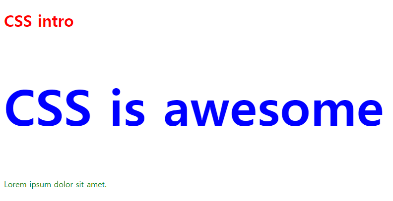
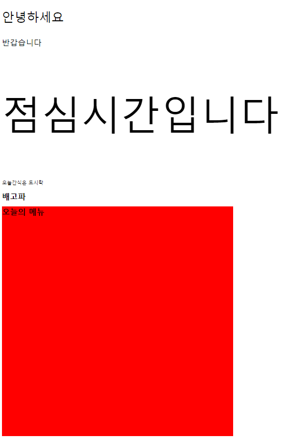
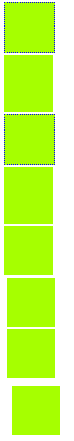
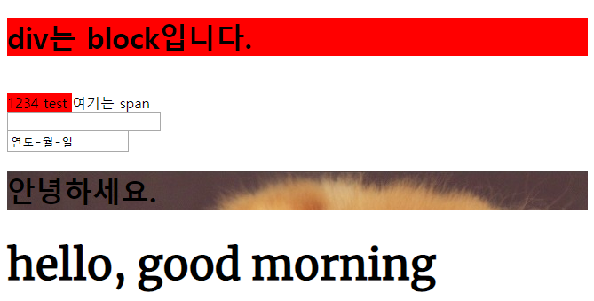
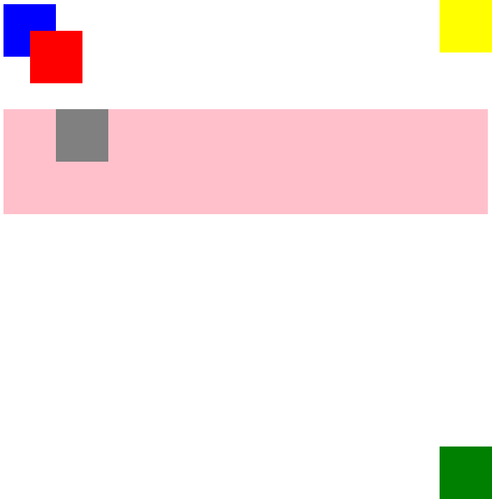
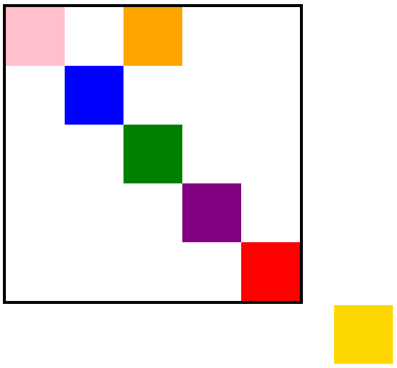

## 190730_Web_CSS

<br>

### 1. CSS 적용하는 방법 3가지?



> 00_intro.html

```html
<!DOCTYPE html>
<html lang="en">
<head>
    <meta charset="UTF-8">
    <meta name="viewport" content="width=device-width, initial-scale=1.0">
    <meta http-equiv="X-UA-Compatible" content="ie=edge">
    <title>Document</title>
    <style>
        h2{
            color: blue;
            font-size: 100px;
        }
    </style>
    <!-- 2. 내부 참조 -->

    <link rel="stylesheet" href="00_intro.css">
    <!-- 3. 외부 참조 -->

</head>
<body>
    <h1 style="color:red;">CSS intro</h1>
    <!-- 1. 인라인: 원래는 금지, 거의 안씀 -->

    <h2>CSS is awesome</h2>
    <p>Lorem ipsum dolor sit amet.</p>
    <!-- Lorem5 + Tab: 더미데이터 5개 랜덤생성 -->
</body>
</html>
```
> 00_intro.css
```css
p{
    color: green;
}
```

### 2. CSS 크기단위 종류



> 01_css_val.html
```html
<!DOCTYPE html>
<html lang="en">
<head>
    <meta charset="UTF-8">
    <meta name="viewport" content="width=device-width, initial-scale=1.0">
    <meta http-equiv="X-UA-Compatible" content="ie=edge">
    <title>Document</title>
    <link rel="stylesheet" href="01_css_val.css">
</head>
<body>
    <p id="hello">안녕하세요</p>
    <p id="welcome">반갑습니다</p>
    <p id="lunch">점심시간입니다</p>
    <p id="snack">오늘간식은 도시락</p>
    <div>
        <h1>배고파</h1>
    </div>
    
    <h1 id="menu">오늘의 메뉴</h1>
</body>
</html>
```

> 01_css_val.css

```css
/* #으로 시작하는건 아이디(특정한 하나) */
#hello{
    /* 픽셀기준 */
    font-size: 50px;
}
#welcome{
    /* 부모기준 */
    font-size: 200%;
}
#lunch{
    /* 배수단위 */
    font-size: 10em;
}

/* div는 부모 */
div{
    width: 50%;
}
/* h1은 자식, 부모의 width를 상속받아서 결국은 50% * 50% = 25% */
h1{
    width: 50%;
}

#snack{
    font-size: 0.5rem;
}
#menu{
    background-color: red;
    /* 뷰포트 단위: 화면비율 반응형 */
    width: 50vw;
    height: 50vh;
}
```

### 3. margin, padding, border



> 02_box.html
```html
<!DOCTYPE html>
<html lang="en">
<head>
    <meta charset="UTF-8">
    <meta name="viewport" content="width=device-width, initial-scale=1.0">
    <meta http-equiv="X-UA-Compatible" content="ie=edge">
    <title>Document</title>
    <link rel="stylesheet" href="02_box.css">
</head>
<body>
    <div class="margin border"></div>
    <div class="margin padding"></div>
    <div class="margin border"></div>
    <div class="margin padding"></div>
    <div class="margin-1"></div>
    <div class="margin-2"></div>
    <div class="margin-3"></div>
    <div class="margin-4"></div>
</body>
</html>
```

> 02_box.css
```css
div{
    width: 200px;
    height: 200px;
    background-color: rgb(166, 255, 0);
}
/* .으로 시작하는건 클래스(여러요소에 가능)  */
.margin{
    margin-top: 10px;
    margin-bottom: 10px;
    margin-left: 10px;
    margin-right: 10px;
}
.padding{
    padding-top: 20px;
    padding-bottom: 10px;
}
.border{
    /* border-width: 2px;
    border-color: blue;
    border-style: dotted; */
    border: 3px blue dotted;
}
/* 모든방향 10 */
.margin-1{
    margin: 10px;
}
/* 상하10 좌우20 */
.margin-2{
    margin: 10px 20px;
}
/* 상10 좌우20 하30 */
.margin-3{
    margin: 10px 20px 30px;
}
/* 상우좌하 순으로  */
.margin-4{
    margin: 10px 20px 30px 40px;
}
```

### 4. inline / block요소 (display 속성)



> 03_display.html
```html
<body>
    <!-- block요소: 가로폭 전체를 차지 (div, h1~h6, p, ol, ul, li, hr, table, form) -->
        <!-- 여백은 margin으로 처리 -->
    <div>
        <h1>div는 block입니다.</h1>
    </div>
    
    <div class="half i">
        <span>1234</span>
        <!-- <h1>여기는 절반만!</h1> -->
    </div>
    <div class="half i">
        <span>test</span>
        <!-- <h1>여기는 절반만!</h1> -->
    </div>    

    <!-- inline요소: content 너비만큼 차지 (input, span, a, img) -->
        <!-- 일반적으로 margin을 줄 수 없다. 그러나 inline-block속성을 통해 가능하다. -->
    <span class="bi">여기는 span</span>
    <input class="b" type="text">
    <input type="date">

    <h1 class="bg">안녕하세요.</h1>
    <h1 class="text">hello, good morning</h1>
</body>
```
> 03_display.css
```css
div{
    background-color: red;
    margin-left: auto; 
    /* block 요소 왼쪽마진 알아서 처리 */
    margin-right: auto;
    /* block 요소 오른쪽마진 알아서 처리 */
}
.half{
    width: 50%;
}
/* display 속성: block/inline/inline-block/none */
.b{
    display: block;
}
.i{
    display: inline;
}
.bi{
    display: inline-block;
    margin-top: 20px;
}
.bg{
    background-image: url(https://t1.daumcdn.net/cfile/tistory/24283C3858F778CA2E)
}
.text{
    font-family: 'Montserrat', sans-serif;
    font-family: 'Merriweather', serif;
    font-size: 3rem;
}
```

### 5. position 속성 (위치지정)



> 04_position.html

```html
<body>
    <div class="blue"></div>
    <div class="red"></div>
    <div class="green"></div>
    <div class="parent">
        <div class="children"></div>
    </div>
    <div class="yellow"></div>
</body>
```

> 04_position.css

```css
div{
    height: 100px;
    width: 100px;
}
.blue{
    background-color: blue;
    position: static;
}
/* relative: 나의 원래위치에 상대적 */
.red{
    background-color: red;
    position: relative;
    left: 50px;
    bottom: 50px;
}
/* absolute: 부모요소를 중심으로 절대적인 위치 */
.green{
    background-color: green;
    position: absolute;
    /* left: 25px;
    top: 25px; */
    right: 0px;
    bottom: 0px;
}
.parent{
    height: 200px;
    width: 100%;
    background-color: pink;
    position: relative;
    /* relative: 자식요소가 부모위치를 기준으로 위치 */
}
.children{
    background-color: gray;
    position: absolute;
    left: 100px;
    bottom: 100px;
}
/* fixed: 스크롤을 내려도 고정된 위치 */
.yellow{
    background-color: yellow;
    position: fixed;
    right: 0px;
    top: 0px;
}
```

### 5-2. position 예제



> 05_box.html

```html
<body>
  <div class="big-box">
    <div class="small-box" id="red"></div>
    <div class="small-box" id="gold"></div>
    <div class="small-box" id="green"></div>
    <div class="small-box" id="blue"></div>
    <div class="small-box" id="pink"></div>
    <div class="small-box" id="purple"></div>
    <div class="small-box" id="orange"></div>
  </div>
</body>
```

> 05_box.css

```css
.big-box {
    position: relative;
    margin: 100px auto 500px;
    border: 5px solid black;
    width: 500px;
    height: 500px;
  }
  
  .small-box {
    width: 100px;
    height: 100px;
  }
  
  #red {
    background-color: red;
    position: absolute;
    right: 0px;
    bottom: 0px;
    /* 큰 사각형 내부의 우측 하단 모서리에 빨간 사각형 위치시키기 */
  }
  
  #gold {
    background-color: gold;
    position: fixed;
    bottom: 50px;
    right: 50px;
    /* 브라우저의 하단에서 50px, 우측에서 50px 위치에 고정하기 */
  }
  
  #green {
    background-color: green;
    position: absolute;
    left: 200px;
    top: 200px;
    /* absolute 이용해서 큰 사각형의 가운데 위치시키기 */
  }
  
  #blue {
    background-color: blue;
    position: relative;
    left: 100px;
    top: 100px;
    /* relative를 사용해서 큰 사각형 좌측 상단 모서리에서 100px, 100px 띄우기 */
  }
  
  #pink {
    background-color: pink;
    position: absolute;
    left: 0px;
    top: 0px;
    /* 큰 사각형 내부의 좌측 상단 모서리로 옮기기*/
  }

  #purple {
    background-color: purple;
    position: absolute;
    left: 300px;
    top: 300px;
  }

  #orange {
    background-color: orange;
    position: absolute;
    left: 200px;
    top: 0px;
  }
```