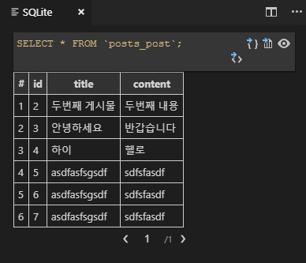

# 190806_Django_Data전달, CRUD

<br>

## 1) Django 데이터 전달하기

> Get	vs	Post

- Get: ~주세요 / 데이터 변화없이 기존의 값 가져온다.
- Post: ~처리해주세요 / 대부분 서버의 정보를 갱신한다. 
  - Create(생성), Read(읽기), Update(갱신), Delete(삭제)

### 1. Get

> views.py

```python
def index(request):
    user_name = request.GET.get('name') 

    # 요청이 GET안에 딕셔너리 형태로 들어와서 get으로 값을 얻음

    # raise
    # 강제 오류발생(어떤값이 넘어오는지 확인할 수 있다.)

    # flask에서는 request.args.get()로 쓰인다.

    context = {
        'name': name
    }

    return render(request, 'index.html', context)
```

> ping.html

```html
<form action="/ping/">
```

### 2. Post

>  views.py

```python
user_name = request.POST.get('name') 

# 요청이 POST안에 딕셔너리 형태로 들어와서 get으로 값을 얻음
```

>  post_ping.html

```html
<form action="/post-pong/" method="post">
	
    
    <!-- 우리 사이트에서 로그인했다는 의미로 새로운 도장을 찍어준다. -->
```

<br>

## 2) Django 정적 파일 관리하기 (static)

> Django에서는 수정이 일어나지 않는 이미지나 css는 static 폴더에 넣어서 사용한다. 

1. pages 폴더 안에 static 폴더를 생성한다. (위치 중요)
2. static 폴더 안에 image 폴더, css 폴더를 생성한다.

### 1. Image, CSS

- ``: static으로 설정되어있는 파일을 불러온다.

- ``: static 파일의 경로를 지정한다.

> static_example.html

```html

 
<!-- extends아래에 위치 -->


  <link rel="stylesheet" href="">
  <h1>보노보노</h1>
  


<!-- static: 서버가 실행됨과 동시에 처음에만 불러오므로 바뀌어도 그대로 유지되므로 서버 재실행해야한다. -->
```

<br>

## 3) Django Url 분리해주기

> app마다 같은 이름의 url이 있을 경우를 대비하여 경로를 구분해준다.

### 1. Master Url

- `from django.urls import path, include`: 임포트

- `include('app이름.urls')`: 책임을 넘겨주겠다.

> django_ad 폴더 > urls.py (마스터)

```python
from django.contrib import admin
from django.urls import path, include
# include 임포트

urlpatterns = [
    path('admin/', admin.site.urls),
    
    # url 형식: 127.0.0.1:8000/pages/ping/ 
    path('pages/', include('pages.urls')),
    path('utilities/', include('utilities.urls')),
]
```

### 2. Sub Url

- `from . import views`: 현재 위치(.)에 있는 views 임포트

> pages 폴더 > urls.py (서브)

```python
from django.urls import path
from . import views
# 현재 위치(.)에 있는 views 임포트

urlpatterns = [
    path('ping/', views.ping),
    path('pong/', views.pong),
    path('post-ping/', views.post_ping),
    path('post-pong/', views.post_pong),
    path('static-example/', views.static_example),
]
```

<br>

## 4) Django ORM, CRUD

### 1. Schema 정의

- 데이터베이스에서 데이터의 구조, 표현방법, 관계 등을 정의한다. 이 구조에 맞는 데이터만 저장한다.

> posts 폴더 > models.py (Model 생성)

```python
from django.db import models

# Create your models here.
class Post(models.Model):
    # models.Model을 상속한다.
    title = models.CharField(max_length=100)
    content = models.CharField(max_length=100)
    # 파이썬코드로 스키마 정의 (CharField는 필수로 길이 정해주기)
```

> 터미널 설정 (ORM으로 변환)

```
$ python manage.py makemigrations
models.py에 작성한 파이썬코드를 sql로 사용하기 위해 번역해준다.(id는 자동생성된다.)

$ python manage.py migrate
번역한 것을 실제 데이터베이스에 적용한다.(테이블스키마로 변환해준다.)

$ python manage.py shell
터미널에서 sql사용이 가능해진다.
```

### 2-1. Data 입력 (터미널)

> $ python manage.py shell 명령어 실행후  (클래스 임포트 일일히 해줘야 함)

```
1. models.py에 class 선언하고 불러오기
$ from posts.models import Post

2. 인스턴스 객체 만들기 (만들면서 값 할당 가능)
$ p = Post()
$ p = Post(title='안녕하세요', content='반갑습니다') 

3. 변수에 값 할당하기 
$ p.title = '안녕하세요' 
$ p.content = '반갑습니다'

4. 데이터베이스에 저장하기
$ p.save()
   
5. 빠져나오기
$ exit()
```

### 2-2. Data 입력 및 불러오기 (터미널)

> $ python manage.py shell_plus 명령어 실행후 (클래스 임포트 해주지 않아도 됨)

```
$ Post.objects.create(title='안녕하세요', content='반갑습니다')
데이터 입력
```

```
$ Post.objects.all()
모든 데이터 불러옴

$ Post.objects.get(id=1) 
1번 데이터 불러옴

$ Post.objects.get(title='안녕하세요')
일치하는 첫번째 데이터 불러옴(하나의 값)

$ Post.objects.filter(title='안녕하세요')
일치하는 데이터 불러옴(여러개의 값)
```

- 차이점?
  - `$ python manage.py shell` → 클래스 임포트 일일히 해줘야 함

  - `$ python manage.py shell_plus` → 클래스 임포트 해주지 않아도 됨

    : 사용하려면  `$ pip install django_extensions` (확장프로그램 설치) +

     settings.py -> INSTALLED_APPS 리스트에 'django_extensions' 넣어줘야 한다.

<br>

### 3. Data 입력 및 불러오기 (Python 코드 안)

> posts 폴더 > views.py

```python
from django.shortcuts import render
from .models import Post
# 현재 위치(.)의 models.py에서 Post 클래스 임포트

# Create your views here.
def new(request):
    return render(request, 'new.html')

def create(request):
    title = request.GET.get('title')
    content = request.GET.get('content')

    # 1.sql 새로운 데이터 생성하는 코드
    post = Post()
    post.title = title
    post.content = content
    post.save()

    return render(request, 'create.html')

def index(request):
    # 2.모든 데이터 불러오는 코드
    # queryset 형태로 보내줌(리스트랑 거의비슷)
    posts = Post.objects.all() 
    
    context = {
        'posts': posts
    }
    return render(request, 'index.html', context)
```

- SQLite explorer 확장프로그램 설치

