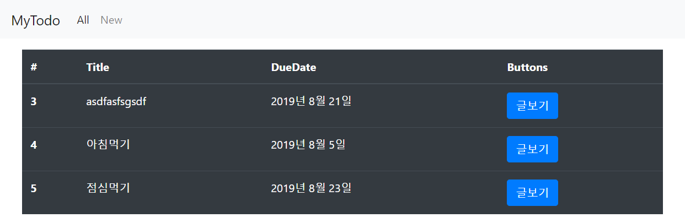

# 190807_Django_Board실습, CRUD

<br>

## 1) Django 관리 페이지 (admin)

> http://127.0.0.1:8000/admin/

- 관리자 id/pw 만들기

  `$ python manage.py createsuperuser` -> id, email(생략가능), pw 설정

### 1. 사이트 등록

> todos폴더 > admin.py

```python
from django.contrib import admin
from .models import Todo
# 현재위치(.)의 models.py에 생성된 Todo 클래스 임포트

# Register your models here.
admin.site.register(Todo)
# admin페이지에 사이트 등록해주기
```

<br>

## 2) Django Board 실습

> ToDo(할일) 등록하고 관리하는 게시판 만들어 보는 시간 !! 

- Project / App name
  - `Project `: board
  - `App`: todos

- Models (class)
  - `Todo` 속성: title (제목), content (내용), due_date (마감기간)

- 페이지(.html) 구성
  
  - `base.html` (부모 html)
  - `new.html` (ToDo등록) - > `create.html` (등록완료)
  - `index.html` (ToDo목록)
  - `detail.html` (ToDo상세정보: 수정, 삭제)
  - `delete.html` (삭제완료)
  - `edit.html` (수정) - > `update.html` (수정완료)
  
- 화면 Navbar 구성 (base.html)

  1. `All`: ToDo목록 보여주는 메뉴

  2. `New`: ToDo등록하는 메뉴

<br>

### 1. 기본구조 작성

1. board 프로젝트 생성 및 `.gitignore` 생성(python, windows, visualstudiocode) [여기](https://gitignore.io)

   ```
   $ django-admin startproject board .
   ```

2. todos 앱 생성 및 board > settings.py > INSTALLED_APPS에 'todos' 추가

   ```
   $ django-admin startapp todos
   ```

   ```python
   INSTALLED_APPS = [
       'todos',
       'django.contrib.admin',
       'django.contrib.auth',
       'django.contrib.contenttypes',
       'django.contrib.sessions',
       'django.contrib.messages',
       'django.contrib.staticfiles',
   ]
   ```

3. board > urls.py > include 임포트 및 path 추가

   ```python
   from django.contrib import admin
   from django.urls import path, include
   
   urlpatterns = [
       path('admin/', admin.site.urls),
       path('todos/', include('todos.urls')),
   ]
   ```

4. todos > urls.py > views 임포트 및 path 추가

   ```python
   from django.urls import path
   from . import views
   
   urlpatterns = [
       # path('todos/'),
       path('new/', views.new),
       path('create/', views.create),
   ]
   ```

5. todos > views.py > `def new()`, `def create()` 추가

   ```python
   from django.shortcuts import render
   
   # Create your views here.
   def new(request):
       return render(request, 'new.html')
   def create(request):
       return render(request, 'create.html')
   ```

6. todos > templates 폴더 생성 > .html 파일 작성 (base, new, create 3개)

<br>

### 2. model 선언

1. todos > models.py > **class Todo 생성** (변수: title, content, due_date)

   ```python
   from django.db import models
   
   # Create your models here.
   class Todo(models.Model):
       title = models.CharField(max_length=50)
       content = models.CharField(max_length=200)
       due_date = models.DateField()
   ```

<br>

### 3. Create & Admin


1. ORM(테이블 스키마) 변환 명령어 2개 실행

   ```
   $ python manage.py makemigrations
   $ python manage.py migrate
   ```

2. todos > admin.py > Todo 클래스 임포트 및 관리자 페이지에 사이트 등록

   ```python
   from django.contrib import admin
   from .models import Todo
   
   # Register your models here.
   admin.site.register(Todo)
   ```

3. todos > views.py > `def create()` 생성 > **새로운 데이터 생성 및 저장**

   ```python
   def create(request):
       title = request.GET.get('title')
       content = request.GET.get('content')
       due_date = request.GET.get('due-date')
       
       # sql 새로운 데이터 생성하는 코드
       # todo = Todo()
       # todo.title = title
       # todo.content = content
       # todo.due_date = due_date
       # todo.save()
   
       todo = Todo(title=title, content=content, due_date=due_date)
       todo.save()
   
       return render(request, 'create.html')
   ```

<br>

### 4. index page



1. todos > urls.py > path 추가

   ```python
   urlpatterns = [
       # Read
       path('', views.index),
   ]
   ```

2. todos > views.py > `def index()` 생성 > **모든 데이터 불러오기**

   ```python
   def index(request):
       # 모든 데이터 불러오는 코드
       # queryset 형태로 보내줌(리스트랑 거의비슷)
       todos = Todo.objects.all()
       context = {
           'todos': todos,
       }
       return render(request, 'index.html', context)
   ```

3. todos > templates > `index.html` 생성 (**bootstrap > table 형태: for문**)

   ```html
   
   
     <table class="table table-dark mt-3">
       <thead>
         <tr>
           <th scope="col">#</th>
           <th scope="col">Title</th>
           <th scope="col">DueDate</th>
           <th scope="col">Buttons</th>
         </tr>
       </thead>
       <tbody>
         
           <tr>
             <th scope="row">{{todo.id}}</th>
             <td>{{todo.title}}</td>
             <td>{{todo.due_date}}</td>
             <td><button>상세보기</button></td>
           </tr>
         
       </tbody>
     </table>
   
   ```

<br>

### 5. detail


1. todos > urls.py > path 추가

   ```python
   urlpatterns = [
       # variable routing
       path('<int:todo_id>/', views.detail),
   ]
   ```

2. todos > views.py > `def detail()` 생성 > **해당 id의 데이터 불러오기**

   ```python
   def detail(request, todo_id):
       todo = Todo.objects.get(id=todo_id)
       context = {
           'todo': todo
       }
       return render(request, 'detail.html', context)
   ```

3. todos > templates > `detail.html` 생성 (bootstrap > jumbotron 형태: 수정, 삭제버튼)

   ```html
   
   
     <div class="jumbotron my-3">
       <h1 class="display-4">{{todo.title}}</h1>
       <p class="lead">{{todo.content}}</p>
       <hr class="my-4">
       <p>{{todo.due_date}}</p>
       <a class="btn btn-warning btn-lg" href="#" role="button">수정</a>
       <a class="btn btn-danger btn-lg" href="#" role="button">삭제</a>
     </div>
   
   ```

4. todos > templates > index.html > **href 경로 추가 (해당 id값 넘겨주기)**

   ```html
   <td><a href="/todos/{{todo.id}}/" class="btn btn-primary">글보기</a></td>
   ```

<br>

### 6. delete & update


1. todos > urls.py > path 추가

   ```python
   urlpatterns = [
       # Update
       path('<int:todo_id>/edit/', views.edit),
       path('<int:todo_id>/update/', views.update),
       # Delete
       path('<int:todo_id>/delete/', views.delete),
   ]
   ```

2. todos > views.py > redirect 임포트 및 `def delete()`, `def edit()`, `def update()` 생성

   ```python
   from django.shortcuts import render, redirect
   # redirect 임포트
   
   def delete(request, todo_id):
       todo = Todo.objects.get(id=todo_id)
       todo.delete()
       # return render(request, 'delete.html')
       return redirect('/todos/')
   	# 삭제완료 페이지로 가지않고 삭제한 뒤 바로 전체목록 페이지로 가도록 설정(redirect)
   
   def edit(request, todo_id):
       todo = Todo.objects.get(id=todo_id)
       context = {
           'todo': todo
       }
       return render(request, 'edit.html', context)
   
   def update(request, todo_id):
       title = request.GET.get('title')
       content = request.GET.get('content')
       due_date = request.GET.get('due-date')
   
       # todo = Todo.objects.get(id=todo_id)
       # todo.title = title
       # todo.content = content
       # todo.due_date = due_date
       # todo.save()
   
       todo = Todo(id=todo_id, title=title, content=content, due_date=due_date)
       todo.save()
   
       # return render(request, 'update.html')
       return redirect(f'/todos/{todo_id}/')
   	# 수정완료 페이지로 가지않고 수정한 뒤 바로 전체목록 페이지로 가도록 설정(redirect)
   ```

- render / redirect 차이점?
  - `return render(request, 'update.html')` → 템플릿(.html)을 불러온다.
  - `return redirect('/todos/')` → Url로 이동한다. -> views 실행

3. todos > templates > `detail.html` > 수정, 삭제 **버튼 경로 지정**

   ```html
   <a class="btn btn-warning btn-lg" href="/todos/{{todo.id}}/edit/" role="button">수정</a>
   <a class="btn btn-danger btn-lg" href="/todos/{{todo.id}}/delete/" role="button" onclick="return confirm('삭제할꺼니?')">삭제</a>
   <!-- javascript 코드로 삭제확인 -->
   ```

4. todos > templates > `edit.html` 생성 (기존의 값 **input태그의 value**로 보여준다.)

   > edit.html

   ```html
   
   
     <form action="/todos/{{todo.id}}/update/" class="m-5">
       <div class="form-group">
         <label for="title">ToDo</label>
         <input type="text" class="form-control" id="title", name="title" value="{{todo.title}}">
         </div>
       <div class="form-group">
         <label for="content">Content</label>
         <input type="text" class="form-control" id="content" name="content" value="{{todo.content}}">
       </div>
       <div class="form-group">
         <label for="due-date">Due Date</label>
         <input type="date" class="form-control" id="due-date" name="due-date" value="{{todo.due_date|date:'Y-m-d'}}">
        <!-- |date:'Y-m-d': Date타입 input value 설정해주는 법 -->   
       </div>
       <button type="submit" class="btn btn-warning">수정</button>
     </form>
   
   ```

- todos = Todo.objects.**order_by('due_date')**.all()

  : 모든 데이터 가져올 때 정렬기준 정해주는 방법
  
  <br>

## 3) Django nonojapan 실습


> home.html


```html


<div class="row m-4">
  
  <div class="col-4">
  <!-- 화면에 card가 3개씩 정렬하기 위해 div에 col-4라는 속성을 주었다. -->
    <div class="card mb-5">
      <ul class="list-group list-group-flush" style="list-style: none">
        <li class="list-group-item"><strong style="margin-left:10px;">{{product.name}}</strong></li>
        <li class="list-group-item"><p>대체상품</p><button type="button" class="btn btn-warning mt-1">{{product.replace}}</button></li>
        <li class="list-group-item text-muted"># {{product.category}}</li>
        <li class="list-group-item mx-auto"><a href="/products/{{product.id}}/" class="btn btn-outline-primary">상세정보</a></li>
      </ul>
    </div>
  </div>
  
  <!-- 상품이 없을때 처리 -->
  <div class="col-4">
    <div class="card mb-5">
      <ul class="list-group list-group-flush" style="list-style: none">
        <li>상품이 없습니다.</li>
        <li>-</li>
        <li>-</li>
        <li></li>
        <li><a href="#" class="btn btn-outline-primary">상세정보</a></li>
      </ul>
    </div>
  </div>
  
</div>

```

> new.html


```html


<div class="container mx-auto">
  <!-- 가운데 정렬하기 위해 container를 만들었다. -->
  <form action="/products/create/" class="mt-3">
    <h3 class="text-warning">제품 추가</h3><hr>
    <div class="form-group">
      <label for="name" class="text-light">제품명</label>
      <input type="text" class="form-control" id="name" name="name">
    </div>
    <div class="form-group">
      <label for="category" class="text-light">카테고리</label><br>
      <select class="form-control" id="category" name="category">
        <option value="패션" selected>패션</option>
        <option value="가전제품">가전제품</option>
        <option value="화장품">화장품</option>
        <option value="기타">기타</option>
      </select>
    </div>
    <div class="form-group">
      <label for="replace" class="text-light">대체상품</label>
      <input type="text" class="form-control" id="replace" name="replace">
    </div>
    <div class="form-group">
      <label for="image" class="text-light">이미지 주소</label>
      <input type="text" class="form-control" id="image" name="image">
    </div>
    <button type="submit" class="btn btn-warning w-100" onclick="return alert('제품이 추가되었습니다.')">추가하기</button>
  </form>
</div>

```

> detail.html


```html


  <div class="jumbotron mt-4">
    
    <h1 class="display-4 mt-3">{{product.name}}</h1>
    <p class="lead"># {{product.category}}</p>
    <hr class="my-4">
    <p>{{product.replace}}</p>
    <a class="btn btn-primary btn-lg" href="/products/{{product.id}}/edit/" role="button">수정</a>
    <a class="btn btn-danger btn-lg" href="/products/{{product.id}}/delete/" role="button">삭제</a>
  </div>

```

> edit.html


```html


  <form action="/products/{{product.id}}/update/" class="mt-3">
    <h5 class="text-warning">제품 수정</h5><hr>
    <div class="form-group">
      <label for="name" class="text-light">제품명</label>
      <input type="text" class="form-control" id="name" name="name" value="{{product.name}}">
    </div>
    <div class="form-group">
      <label for="category" class="text-light">카테고리</label><br>
      <select class="form-control" id="category" name="category" value="{{product.category}}">
        <option value="패션" selected>패션</option>
        <option value="가전제품">가전제품</option>
        <option value="화장품">화장품</option>
        <option value="기타">기타</option>
      </select>
    </div>
    <div class="form-group">
      <label for="replace" class="text-light">대체상품</label>
      <input type="text" class="form-control" id="replace" name="replace" value="{{product.replace}}">
    </div>
    <div class="form-group">
      <label for="image" class="text-light">이미지 주소</label>
      <input type="text" class="form-control" id="image" name="image" value="{{product.image}}">
    </div>
    <button type="submit" class="btn btn-warning w-100" onclick="return alert('제품정보가 수정되었습니다.')">수정하기</button>
  </form>

```

