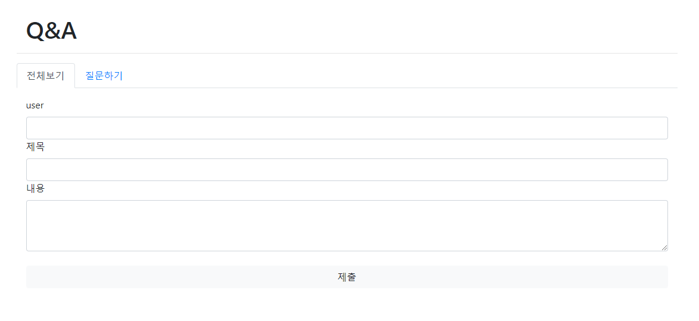

# 190808_Django_QnA실습, CRUD

<br>

## 1) Django QnA 종합 실습

> QnA 등록하고 관리하는 게시판 만들어 보는 시간 !! 

- Project / App name
  - `Project `: qna
  - `App`: articles

- Models (class)
  - `Question` 질문 속성: title (제목), content (내용), user (마감기간), created_at (작성시간)
  - `Answer` 댓글 속성: content(내용), question(질문번호: 외래키, cascade옵션)

- 페이지(.html) 구성

  - `base.html` (부모 html)
  - `new.html` (Question등록)
  - `index.html` (QnA목록)
  - `detail.html` (ToDo상세정보: 수정, 삭제)
  - `delete.html` (삭제완료)
  - `edit.html` (수정) - > `update.html` (수정완료)

- 화면 Navbar 구성 (base.html)

  1. `All`: ToDo목록 보여주는 메뉴

  2. `New`: ToDo등록하는 메뉴

<br>

### 1. startproject & startapp

1. qna 프로젝트 생성 및 `.gitignore` 생성(python, windows, visualstudiocode) [여기](https://gitignore.io)

   ```
   $ django-admin startproject qna .
   ```

2. articles 앱 생성 및 qna > settings.py > INSTALLED_APPS에 'articles' 추가

   ```
   $ django-admin startapp articles
   ```

   ```python
   INSTALLED_APPS = [
       'articles',
       'django.contrib.admin',
       'django.contrib.auth',
       'django.contrib.contenttypes',
       'django.contrib.sessions',
       'django.contrib.messages',
       'django.contrib.staticfiles',
   ]
   ```

3. qna > urls.py > include 임포트 및 path 추가

   ```python
   from django.contrib import admin
   from django.urls import path, include
   
   urlpatterns = [
       path('admin/', admin.site.urls),
       path('questions/', include('articles.urls')),
       # 경로이름과 App이름이 달라도 된다.
   ]
   ```

4. articles > urls.py > views 임포트 및 path 추가

   ```python
   from django.urls import path
   from . import views
   
   urlpatterns = [
       # Create
       path('new/', views.new),
       # Read
   ]
   ```

5. articles > views.py > `def new()` 추가

   ```python
   from django.shortcuts import render
   
   # Create your views here.
   def new(request):
       return render(request, 'new.html')
   ```

6. articles > templates 폴더 생성 > .html 파일 작성 (base, new 2개)

<br>

### 2. models 선언 & migration

1. articles > models.py > **class Question 생성** (변수: title, content, user, created_at)

   ```python
   from django.db import models
   
   # Create your models here.
   class Question(models.Model):
       title = models.CharField(max_length=50)
       content = models.CharField(max_length=100)
       user = models.CharField(max_length=20)
       created_at = models.DateTimeField(auto_now_add=True)
       # 자동으로 현재시간 추가해준다.
   ```

2. ORM(테이블 스키마) 변환 명령어 2개 실행

   ```
   $ python manage.py makemigrations
   $ python manage.py migrate
   ```

<br>

### 3. admin.site.register

2. articles > admin.py > Question 클래스 임포트 및 관리자 페이지에 사이트 등록

   ```python
   from django.contrib import admin
   from .models import Question 
   
   # Register your models here.
   admin.site.register(Question)
   ```

<br>

### 4. new & create 완성

1. articles > views.py > `def create()` > **질문 데이터 생성 및 저장**

   ```python
   from django.shortcuts import render, redirect
   from .models import Question
   
   # Create your views here.
   def new(request):
       return render(request, 'new.html')
   
   def create(request):
       user = request.GET.get('user')
       title = request.GET.get('title')
       content = request.GET.get('content')
       
       question = Question(user=user, title=title, content=content)
       question.save()
   
       return redirect('/questions/')
   ```

<br>

### 5. index

1. articles > urls.py > path 추가

   ```python
   urlpatterns = [
       # Read
       path('', views.index),
   ]
   ```

2. articles  > views.py > `def index()` 생성 > **모든 데이터 불러오기**

   ```python
   def index(request):
       questions = Question.objects.all()
       context = {
           'questions': questions
       }
       return render(request, 'index.html', context)
   ```
   
3. articles > templates > `index.html` 생성 (**for문**)

   ```html
   
   
     
       <h1>{{question.title}}</h1>
       <p>{{question.user}}</p>
       <p>{{question.content}}</p>
       <hr>
     
   
   ```

<br>

### 6. answer_create

1. articles > models.py > Answer 클래스 추가

   ```python
   class Answer(models.Model):
       content = models.CharField(max_length=50)
       question = models.ForeignKey(Question, on_delete=models.CASCADE)
       # 질문번호 외래키 (CASCADE 옵션: 질문이 삭제되면 댓글도 같이 삭제됨)
   ```

2. articles > templates > `index.html` **댓글 기능 추가** (**for문**)

   ```html
   
   
     
       <h1>{{question.title}}</h1>
       <p>{{question.user}}</p>
       <p>{{question.content}}</p>
       <form action="/questions/{{question.id}}/answers/create/">
       <!-- 질문번호별 댓글 경로 지정해준다. -->
         <input type="text" name="content">
         <input type="submit">
       </form>
       <hr>
     
   
   ```

3. articles > urls.py > path 추가

   ```python
   urlpatterns = [
       # Read
       path('<int:question_id>/answers/create/', views.answer_create)
   ]
   ```
   
4. articles  > views.py > `def answer_create()` 생성 > **댓글 데이터 저장하기**

   ```python
   def answer_create(request, question_id):
       content = request.GET.get('content')
       question = Question.objects.get(id=question_id)
       # 질문번호를 외래키연결하기 위해 Question클래스에서 직접 가져와야 한다.
       
       answer = Answer(content=content, question=question)
       answer.save()
   
       return redirect('/questions/')
   ```

<br>

### 7. html & bootstrap


1. articles > templates > `index.html` > **bootstrap** (Components > Collapse > **Accordion 사용**)

   ```html
   
   
     
       <div class="accordion" id="accordionExample">
         <div class="card m-3">
           <div class="card-header" id="headingOne">
             <h2 class="mb-0">
               <button class="btn btn-link" type="button" data-toggle="collapse" data-target="#collapseOne{{question.id}}" aria-expanded="false" aria-controls="collapseOne{{question.id}}">
                 <h5 style="color:black">{{question.title}}</h5>
               </button>
             </h2>
           </div>
           <div id="collapseOne{{question.id}}" class="collapse" aria-labelledby="headingOne" data-parent="#accordionExample">
             <div class="card-body">
               <p>{{question.user}}</p>
               <p class="text-muted">{{question.content}}</p><hr>
               <p class="mx-3 text-muted">comment</p>
               <form action="/questions/{{question.id}}/answers/create/" class="mx-3">
                 <!-- 질문번호별 댓글 경로 지정해준다. -->
                 <div class="input-group mb-3 w-50">
                   <input type="text" class="form-control" name="content">
                   <div class="input-group-append">
                     <button class="input-group-text" type="submit" id="button-addon2">등록</button>
                   </div>
                 </div>
               </form>
               
               <!-- .answer(클래스이름)_set.all: 해당 질문번호에 연결된 댓글만 보여준다. -->
                 <p class="mx-4">{{answer.content}}</p>
               
             </div>
           </div>
         </div>
       </div>
     
   
   ```



2. articles > templates > `new.html` > **bootstrap** (Components > Collapse > **Components > Form controls 사용**)

   ```html
   
   
     <form action="/questions/create/" class="m-3">
       <div class="form-group">
         <label for="user">user</label>
         <input type="text" class="form-control" id="user" name="user">
         <label for="title">제목</label>
         <input type="text" class="form-control" id="title" name="title">
         <label for="content">내용</label>
         <textarea class="form-control" id="content" rows="3" name="content"></textarea><br>
         <input type="submit" class="form-control btn btn-light">
       </div>
     </form>
   
   ```