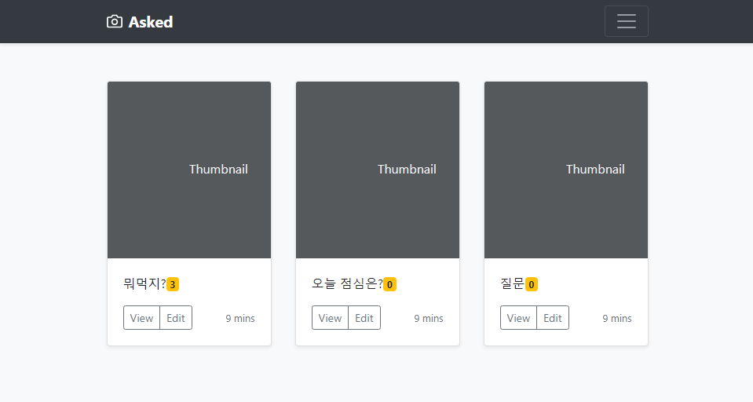
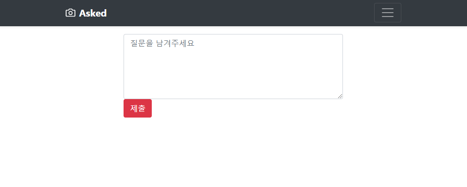
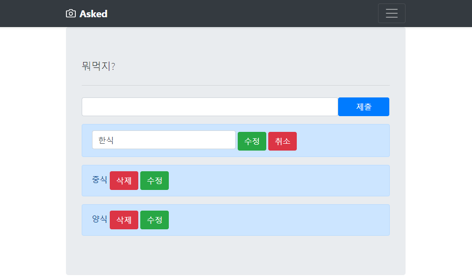
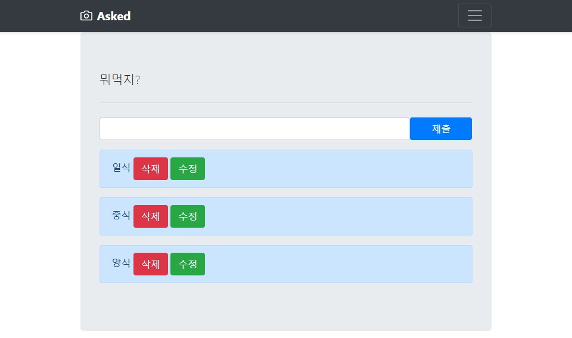
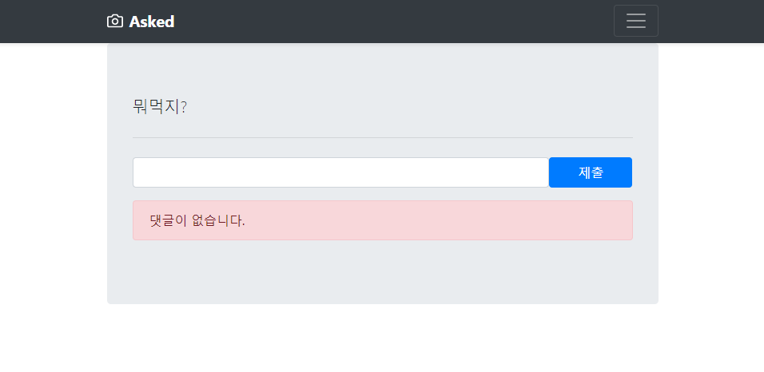

# 191007_Django_Asked

## Asked 익명질문 사이트 기능 만들어보기

- #### 기본 구성

```
* Project / App name
  - Project: asked
  - App: questions
  
* Models (class)
  - Question 질문 속성: content(내용)
  - Answer 댓글 속성: content(내용), question(질문번호: 외래키, cascade옵션)
  
* 페이지(.html) 구성
  - base.html (부모 html)
  - form.html (Question작성)
  - index.html (QnA목록)
  - detail.html (ToDo상세정보: 수정, 삭제)
```

> questions > urls.py

```python
from django.urls import path
from . import views

app_name = 'questions'

urlpatterns = [
    # Read
    path('', views.index, name="index"),
    path('<int:id>/', views.detail, name="detail"),
    # Create
    path('create/', views.create, name="create"),
    path('<int:question_id>/answers/', views.answer_create, name="answer_create"),
    # Delete
    path('<int:question_id>/answers/<int:answer_id>/delete/', views.answer_delete, name="answer_delete" ),
    # Update
    path('<int:question_id>/answers/<int:answer_id>/update/', views.answer_update, name="answer_update"),
]
```

<br>

## 새로 배운 것

### 1. 외래키(ForeignKey)

- 1:N (질문:답) 기능 추가하기

  > questions -> models.py

  ```python
  # 댓글 모델
  class Answer(models.Model):
      content = models.CharField(max_length=100)
      # 하나의 Question에 관계된다.
      question = models.ForeignKey(Question, on_delete=models.CASCADE)
  ```

- **django-extensions** 설치 후 사용하기 -> 터미널에서 파이썬코드로 DB조작

  ```
  $ pip install django-extensions
  ```

  ```python
  INSTALLED_APPS = [
  	'django_extensions',
  ]
  ```

  ```
  $ python manage.py shell_plus # 사용하기
  ```

  #### 1) 게시물 불러오기 (READ)

  ```python
  In [6]: question = Question.objects.get(id=1) 
      # 꼭 있는 데이터만 찾아야함.(아니라면 오류발생)
  ```

  #### 2) 댓글 작성하기 (CREATE)

  ```python
  # 첫번째 방법
  In [7]: answer = Answer() # Answer 인스턴스 생성
  In [11]: answer.content = '이것은 댓글입니다.' # content 변수 지정
  
  In [12]: answer
  Out[12]: <Answer: Answer object (None)> 
          # question변수 지정을 안해줘서 None값이 나온다.(fk는 필수로 값이 있어야 함.)
          # None은 값이 없는 상태이고 DB에 저장되지 않음.
          # 이상태로 저장하면 IntegrityError: NOT NULL constraint failed 에러 발생
          
  In [15]: answer.question = question # question 변수 지정 
  In [19]: answer.save() # 저장
      
  In [20]: answer
  Out[20]: <Question: Question object (1)>
  
  # 두번째 방법
  In [23]: Answer.objects.create(content='두번째', question=question)
  Out[23]: <Answer: Answer object (2)>
  ```

  #### 댓글 정보

  ```python
  In [25]: answer.question
  Out[25]: <Question: Question object (1)>     
  
  In [26]: answer.id
  Out[26]: 1
  In [27]: answer.pk # primary key(고유값) = id와 같다
  Out[27]: 1
  
  In [28]: answer.question_id # answer가 가지고 있는 question의 id값 (속도 좀더 빠름)
  Out[28]: 1
  In [30]: answer.question.id # question이 가지고 있는 id값 (타고들어감)
  Out[30]: 1
      
  In [32]: answer.delete() # answer 인스턴스 삭제
  In [45]: dir(Answer) # Answer 클래스가 쓸 수 있는 method목록(디렉토리)
  ```

  ### 1:N ★

  - Qustion(1) -> Answer(N) : `answer_set`

    ```python
    In [36]: question.answer_set.all()
    Out[36]: <QuerySet [<Answer: Answer object (1)>, <Answer: Answer object (2)>]>
    ```

    - `question.answer`로는 가져올 수 없다.
    - 항상 복수라고 생각 (몇개가 있는지 모르기때문에 1개일 때도 QuerySet이라는 리스트형태로 존재한다.)

  - Answer(N) -> Question(1) : `question`

    ```python
    In [25]: answer.question
    Out[25]: <Question: Question object (1)>     
    ```

<br>

## 결과물

- ##### 메인페이지



> index.html

```html


<main role="main">
  
  <div class="album py-5 bg-light">
    <div class="container">

      <div class="row">
        
        <!-- md사이즈일 때 12칸 중 4칸을 차지한다. -->
        <div class="col-md-4"> 
          <div class="card mb-4 shadow-sm">
            <svg class="bd-placeholder-img card-img-top" width="100%" height="225" xmlns="http://www.w3.org/2000/svg" preserveAspectRatio="xMidYMid slice" focusable="false" role="img" aria-label="Placeholder: Thumbnail"><title>Placeholder</title><rect width="100%" height="100%" fill="#55595c"></rect><text x="50%" y="50%" fill="#eceeef" dy=".3em">Thumbnail</text></svg>
            <div class="card-body">
              <!-- 댓글개수 -->
              <!-- question.answer_set.all.count -->
              <!-- question.answer_set.all|length -->
              <p class="card-text">{{question.content}}<span class="badge badge-warning">{{question.answer_set.all|length}}</span></p>
              <div class="d-flex justify-content-between align-items-center">
                <div class="btn-group">
                  <!-- 상세정보: question_id를 인자로 넘겨준다. -->
                  <a href="" class="btn btn-sm btn-outline-secondary">View</a>
                  <a href="" class="btn btn-sm btn-outline-secondary">Edit</a>
                </div>
                <small class="text-muted">9 mins</small>
              </div>
            </div>
          </div>
        </div>
        <!-- empty 예외처리(질문이 없을 때) -->
        
          <h1 class="text-center">질문이 없습니다 ㅠㅠ</h1>
        
      </div>
    </div>
  </div>

</main>

```

- ##### 질문페이지



> form.html

```html


<div class="container w-50 my-3">
  <form action="" method="post">
    
    <textarea name="content" id="" class="form-control" rows="5" value="" placeholder="질문을 남겨주세요"></textarea>
    <input class="btn btn-danger" type="submit">
  </form>
</div>

```

- ##### 답변 및 수정페이지★







> update.html

```html


<div class="container">
  <div class="jumbotron">
    <p class="lead">{{question.content}}</p>
    <hr class="my-4">
    <form action="" method="post">
      
        <div class="container my-3">
        <div class="row">
          <input class="form-control col-10 " type="text" name="content">
          <input class="btn btn-primary col-2"  type="submit">
        </div>
      </div>
    </form>
    <!-- if문 예외처리(댓글이 존재할 때) -->
    
      <!-- question.answer_set.all: 모든 댓글 불러오기 -->
      
        
        <div class="alert alert-primary" role="alert">
          <form action="" method="post">
              
            <input class="form-control w-50 d-inline" type="text" value="{{answer.content}}" name="content">
            <input type="submit" class="btn btn-success" value="수정">
            <a href="" class="btn btn-danger">취소</a>
          </form>
        </div>
        
        <div class="alert alert-primary" role="alert">
            {{answer.content}}
            <a href="" class="btn btn-danger">삭제</a>
            <a href="" class="btn btn-success">수정</a>
        </div>
        
      
    
      <div class="alert alert-danger" role="alert">
        댓글이 없습니다.
      </div>
    
  </div>
</div>

```

<hr>

> questions > urls.py

```python
from django.urls import path
from . import views

app_name = 'questions'

urlpatterns = [
    # Read
    path('', views.index, name="index"),
    path('<int:id>/', views.detail, name="detail"),
    # Create
    path('create/', views.create, name="create"),
    path('<int:question_id>/answers/', views.answer_create, name="answer_create"),
    # Delete
    path('<int:question_id>/answers/<int:answer_id>/delete/', views.answer_delete, name="answer_delete" ),
    # Update
    path('<int:question_id>/answers/<int:answer_id>/update/', views.answer_update, name="answer_update"),
]
```

<hr>

> questions > views.py

```python
from django.shortcuts import render, redirect
from .models import Question, Answer
# Create your views here.
def index(request):
    questions = Question.objects.all()
    context = {
        'questions': questions
    }
    return render(request, 'index.html', context)

def detail(request, id):
    question = Question.objects.get(id=id)
    # 해당 질문의 댓글만 가져오는 방법도 있다.
    # answers = Answer.objects.filter(question=question)
    context = {
        'question': question
    }
    return render(request, 'detail.html', context)

def create(request):
    if request.method == "POST":
        content = request.POST.get('content')
        Question.objects.create(content = content)
        return redirect('questions:index')
    else:
        return render(request, 'form.html')

def answer_create(request, question_id):
    if request.method == "POST":
        content = request.POST.get('content')
        # question 인스턴스 자체를 Answer 인스턴스 인자로 저장한다.
        question = Question.objects.get(id=question_id)
        Answer.objects.create(content=content, question=question)
        # 해당 질문 페이지로 이동하기 위해 url에 question번호를 함께 보내준다.
        return redirect('questions:detail', question_id)
    
def answer_delete(request, question_id, answer_id):
    # 해당 댓글을 삭제하기 위해 answer_id가 필요하다.
    answer = Answer.objects.get(id=answer_id)
    answer.delete()
    # 해당 질문 페이지로 이동하기 위해 url에 question번호를 함께 보내준다.
    return redirect('questions:detail', question_id) 

def answer_update(request, question_id, answer_id):
    question = Question.objects.get(id=question_id)
    answer = Answer.objects.get(id=answer_id)
    if request.method == "POST":
        content = request.POST.get('content')
        answer.content = content
        answer.question = question
        answer.save()
        return redirect('questions:detail', question_id)
    else:
        context = {
            'question': question,
            'answer': answer, 
            'answer_id': answer_id
        }
        return render(request, 'update.html', context)
```