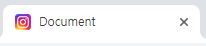
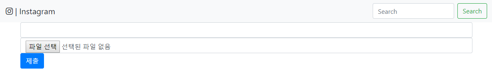
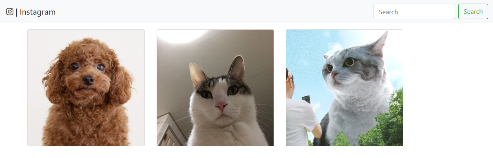

# 191010_Django_실습

## Instagram 사진업로드하는 기능 만들어보기

- #### 기본 구성

```
* Project / App name
  - Project: insta
  - App: feeds
  
* Models (class)
  - Feed 속성: content(내용), created_at(작성시간), image(사진)
  
* 페이지(.html) 구성
  - base.html (부모 html)
  - form.html (게시물 작성)
  - index.html (게시물 목록)
```

<br>

## 새로 배운 것

### 1. Static(이미지 파일 업로드)

- favicon 설정하기

  1. feeds > `static` 폴더 생성 후 insta.png 저장

  2. base.html 맨위에 `` 작성하고 head태그 안에 link 태그 추가

  ```html
  <link rel="icon" href="">
  ```

   

- navbar에 insta 아이콘추가 [fontawesome]([https://fontawesome.com](https://fontawesome.com/))

  ```html
  <nav class="navbar navbar-light bg-light">
  	<a class="navbar-brand"><i class="fab fa-instagram"></i> | Instagram</a>
      <!-- 아이콘 추가 -->
      <form class="form-inline">
        <input class="form-control mr-sm-2" type="search" placeholder="Search" aria-label="Search">
        <button class="btn btn-outline-success my-2 my-sm-0" type="submit">Search</button>
      </form>
  </nav>
  ```

- Feed 모델 생성 후 `Pillow` 설치 -> db 날리고 다시 migration 해줘야 한다.

  > feeds > models.py

  ```python
  class Feed(models.Model):
      content = models.CharField(max_length=150)
      created_at = models.DateTimeField(auto_now_add=True) # 등록시간
      image = models.ImageField() # 이미지필드
  ```

  ```bash
  $ pip install Pillow # 이미지를 저장(기본적으로 넣을 수 없기 때문에 migration할 때 오류 발생)
  ```

- 폼에서 이미지파일 업로드하기

  1. form.html > form태그 안에 `enctype="multipart/form-data"` 추가(파일, 이미지를 서버로 전송할 경우 꼭 지정해주어야 함. 그렇지 않으면 경로만 전송이 되고 내용은 전송이 되지 않기 때문이다.)
  2. input태그 안에 `type="file"` 로 이미지 파일 보내기 (`accpet="image/*"`: 파일타입설정)

  

  ```html
  
  
    <form action="" method="post" enctype="multipart/form-data">
      
      <input class="form-control" type="text" name="content">
      <input class="form-control" type="file" name="image" accept="image/*"> 
      <!-- 이미지파일 보내기 -->
      <input class="btn btn-primary" type="submit">
    </form>
  
  ```

  3. views.py > `request.FILES.get('')` 로 이미지 파일 받기

  ```python
  from IPython import embed
     from django.shortcuts import render, redirect
     from .models import Feed
     
     def create(request):
         if request.method == 'POST':
             content = request.POST.get('content')
             image = request.FILES.get('image') 
             # 이미지파일 받기
             feed = Feed.objects.create(content=content, image=image)
             # embed() # 잠시 멈춰서 feed에 어떤값이 들어있는지 확인(디버깅)
             return redirect('feeds:index')
         else:
             return render(request, 'form.html')
  ```

- 받은 이미지파일 저장위치 지정

  1. insta > settings.py 맨아래에 저장위치 추가 -> `media`라는 폴더에 사진이 저장됨.

  ```python
  MEDIA_URL = '/media/'
  
  MEDIA_ROOT = os.path.join(BASE_DIR, 'media')
  ```

- 이미지파일마다 고유의 url경로를 생성 -> 그 경로로 접근하여 사용자에게 보여줌.

  ```
  urlpatterns += static(settings.MEDIA_URL, document_root=settings.MEDIA_ROOT)
  ```

- 사용자에게 보여주기

  1. index.html > img 태그의 경로를 `src="{{feed.image.url}}"` 로 지정

  ```html
  
  
    
    <div class="card" style="width: 18rem;">
      
      <!-- 이미지 경로 (.url) -->
      <div class="card-body">
        <h5 class="card-title">Card title</h5>
        <p class="card-text">Some quick example text to build on the card title and make up the bulk of the card's content.</p>
        <a href="#" class="btn btn-primary">Go somewhere</a>
      </div>
    </div>
    
  
  ```


- 사진크기 규격 정하여 자르기

  1. 터미널에서 `pilkit` /` django-imagekit` 설치하고
  2. insta > settings.py에 설치된앱  `'imagekit'` 추가

  ```bash
  $ pip install pilkit django-imagekit # 2개 설치
  ```

  ```python
  INSTALLED_APPS = [
      'imagekit',
  ]
  ```

  3. feeds > models.py에서 사진필드 수정 (ImageField -> `ProcessedImageField`)
  4. 모델이 바뀌었기 때문에 `python manage.py makemigrations` 및 `python manage.py migrate` 해주기

  ```python
  from django.db import models
  from imagekit.models import ProcessedImageField
  from imagekit.processors import ResizeToFill
  
  # Create your models here.
  class Feed(models.Model):
      content = models.CharField(max_length=150)
      created_at = models.DateTimeField(auto_now_add=True)
      image = ProcessedImageField(
                  processors=[ResizeToFill(300,300)], # 비율이 안깨지게(리스트형태)
                  format='JPEG',
                  options={'quality':90}, # 생략해도 상관없음
                  upload_to='feeds' # 경로
              )
  ```

  

## 결과물

- ##### 메인페이지



```html


  <div class="row">
    
      <div class="col-3 m-3">
      <!-- 열 3칸씩 차지 -->
      <div class="card" style="width: 18rem;">
        
        <!-- 이미지 경로 (.url) -->
      </div>
    </div>
      
  </div>

```

