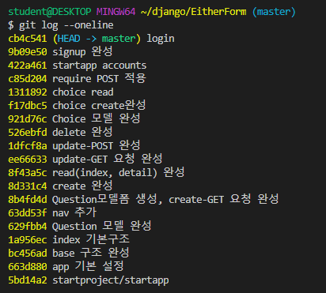
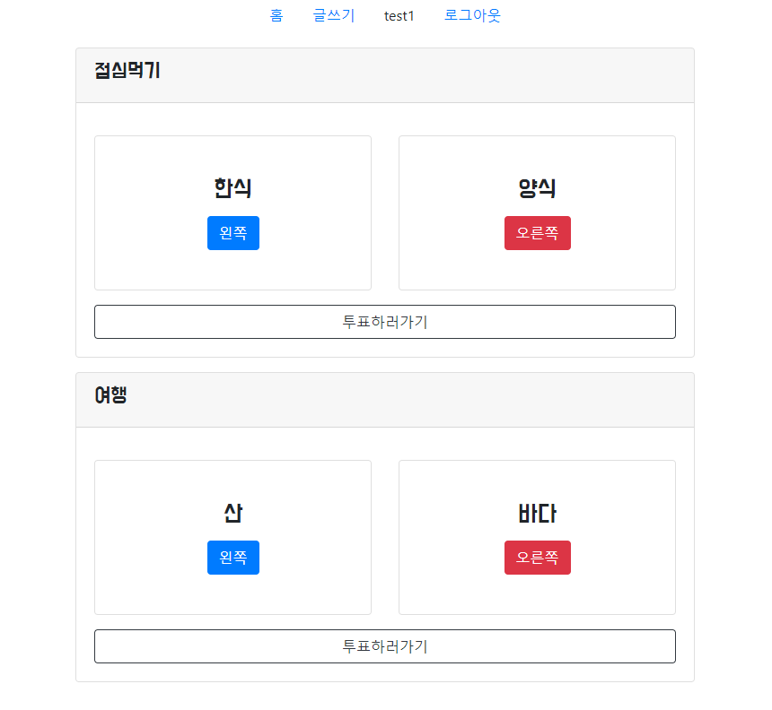
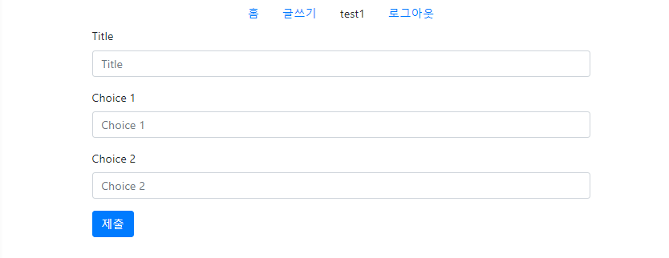
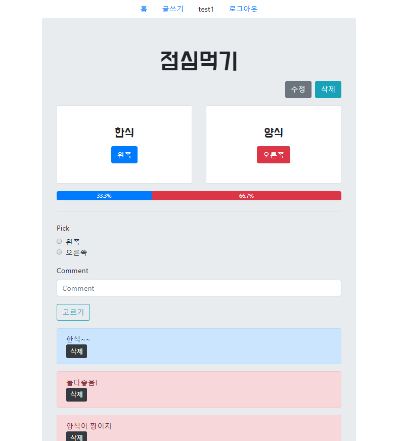
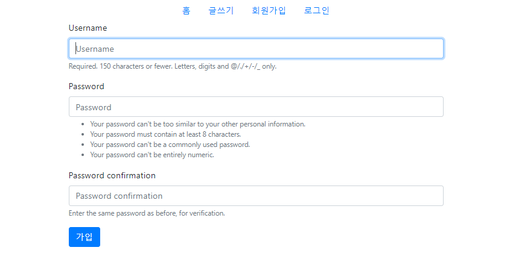
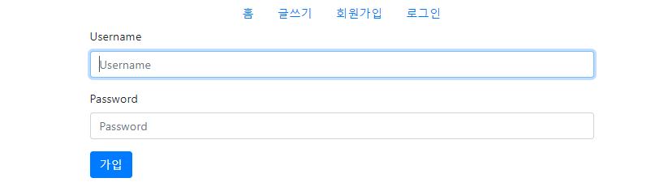

# 191016_Django_Signup/Login/Logout

## App 2개 만들어보기 (회원가입 기능 추가)

> 기능이 다르기 때문에 새로운 앱을 만들어 독립적으로 분리한다.




#### 앱 > templates > app 폴더 > .html 생성

> 동일한 이름의 html파일 충돌을 막기위해서 앱마다 구분해준다.(경로앞에 appname/ )
>
> ex) return render(request, 'questions/form.html', context)

<br>

## 새로 배운 것

### 1) @require_POST

> 함수조건에 맞지않으면 아래코드가 실행되지 않고 대신에 405에러페이지를 보내준다. (POST/GET 분기하지않아도된다.)
>

questions > `views.py` 

```python
from django.views.decorators.http import require_POST
```

```python
@require_POST
def choice_create(request, id):
    question = get_object_or_404(Question, id=id)
    choice_form = ChoiceForm(request.POST)
    if choice_form.is_valid():
        choice = choice_form.save(commit=False) # 함수호출을 지연
        choice.question = question
        choice.save()
    return redirect("questions:detail", id)

@require_POST
def choice_delete(request, question_id, choice_id):
    choice = get_object_or_404(Choice, id=choice_id) 
    choice.delete()
    return redirect('questions:detail', question_id)
```

### 2) @login_required

> 로그인상태에서만 글쓰기 기능이 가능하다. (자동으로 로그인페이지로 이동)

```python
from django.contrib.auth.decorators import login_required
```

```python
@login_required
def create(request):
    # 1. 사용자가 데이터를 입력하기 위해서 GET요청(폼을 요청)
    # 6. 사용자가 올바르지 않은 데이터를 입력하고 POST요청
    # 12. 사용자가 올바른 데이터를 입력하고 POST요청

    # 7. POST method로 들어오기 때문에 if문 실행
    # 13. POST method로 들어오기 때문에 if문 실행
    if request.method == "POST":
        # 8. 사용자의 데이터를 모델폼에 입력
        # 14. 사용자의 데이터를 모델폼에 입력
        form = QuestionForm(request.POST)
        # 9. 데이터가 올바른지 검증
        # 15. 데이터가 올바른지 검증
        if form.is_valid():
            # 16. 데이터가 검증을 통과하고 저장
            form.save()
            # 17. 저장 후 메인으로 이동
            return redirect('questions:index')
    # 2. GET method로 들어오기 때문에 else문 실행
    else:
        # 3. 사용자에게 빈 폼을 보여주기 위해서 모델폼을 인스턴스화 한 후 form 변수에 저장
        form = QuestionForm()
    # 4. dict로 만들기
    # 10. 검증을 통과 못했을 경우 -> 올바른 데이터는 남기고 다시 폼 보여주기
    context = {
        'form': form
    }
    # 5. form.html 보여주기
    # 11. form.html 보여주기
    return render(request, 'questions/form.html', context)
```

### 3) Form 라디오버튼 출력

questions > `forms.py` 에서 폼 클래스 생성

```python
from django import forms
from .models import Question, Choice

class QuestionForm(forms.ModelForm):
    class Meta:
        model = Question
        fields = '__all__'

class ChoiceForm(forms.ModelForm):
    # 라디오버튼으로 출력한다.
    choices = [(1, '왼쪽'), (2, '오른쪽')]
    pick = forms.ChoiceField(choices=choices, widget=forms.RadioSelect)
    class Meta:
        model = Choice
        fields = ('pick', 'comment',)
```

### 4) 조건에 맞는 데이터 개수세기

```python
choices = question.choice_set.all()
total_1 = choices.filter(pick=1).count()
total_2 = choices.filter(pick=2).count()
```

### 5) 소수점 처리

```html
<p>{{percent_1|floatformat}}%</p>
<p>{{percent_2|floatformat}}%</p>
```

<br>

## Signup /  Login / Logout 기능 ★

> `Session`을 데이터베이스에 저장하는 과정 (Create로직과 동일하다.)
>
> Session이 만료되면 로그아웃 된다.

### base.html

```html
<!-- 인증이 되었다면 유저이름과 로그아웃버튼이 보이게 -->

<li class="nav-item">
    <a class="nav-link disabled">{{user.username}}</a>
</li>
<li class="nav-item">
    <a class="nav-link active" href="">로그아웃</a>
</li>

<li class="nav-item">
    <a class="nav-link active" href="">회원가입</a>
</li>
<li class="nav-item">
    <a class="nav-link active" href="">로그인</a>
</li>

```

### urls.py

```python
from django.urls import path
from . import views

app_name = 'accounts'

urlpatterns = [
    path('signup/', views.signup, name='signup'),
    path('login/', views.login, name='login'),
    path('logout/', views.logout, name='logout'),
]

```

### views.py

```python
from django.shortcuts import render, redirect
from django.contrib.auth.forms import UserCreationForm, AuthenticationForm
from django.contrib.auth import login as auth_login # 함수와 이름이 겹치기 때문에 바꿔준다.
from django.contrib.auth import logout as auth_logout


def signup(request):
    if request.method == "POST":
        form = UserCreationForm(request.POST)
        if form.is_valid():
            form.save()
            return redirect('questions:index')
    else:
        # 회원가입 할 수 있는 폼 만든다.(ModelForm과 구조동일)
        form = UserCreationForm()
    context = {
        'form': form,
    }
    return render(request, 'accounts/form.html', context)


def login(request):
    if request.method == "POST":
        form = AuthenticationForm(request, request.POST)
        if form.is_valid():
            auth_login(request, form.get_user())
            return redirect(request.GET.get('next') or 'posts:index')
    else:
        # 인증을 하기위한 폼을 만든다.(ModelForm과 구조동일)
        form = AuthenticationForm()
    context = {
        'form': form,
    }
    return render(request, 'accounts/form.html', context)


def logout(request):
    auth_logout(request)
    return redirect('questions:index')
```

<br>

## 결과물

- questions > templates > questions > index.html (**홈**)



- questions > templates > questions > create.html (**글쓰기**)



- questions > templates > questions > detail.html (**상세정보**)



- accounts > templates > accounts > form.html (**회원가입**)



- accounts > templates > accounts > form.html (**로그인**)



