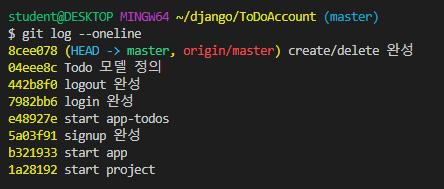

# 191017_Django_TodoAccount

> **User와 게시물 관계설정**하여 회원가입, 로그인, 로그아웃 및 회원의 글만 출력되게 한다.



#### Authorization (권한) vs Authentication (인증)

<br>

#### wunderlist 프로젝트 > templates > base.html 생성

> 모든 app에서 사용하기 위해 base.html을 프로젝트에 생성해준다. 
>
> 그 후, settings.py 에 현재 경로를 추가한다.

```python
TEMPLATES = [
	'DIRS': [os.path.join(BASE_DIR, 'wunderlist', 'templates')], # 추가적인 경로 설정
    'APP_DIRS': True, # 모든 app의 templates를 한데 모아준다.(기본으로 설정되어있음.)
]
```

> 이렇게 하면 다른앱의 템플릿에서 상속받을 때 `` 를 작성하면 된다.

<br>

## 새로 배운 것

### 1)  User: 게시물(Todo) => 1:N 관계

todos > `models.py` 

```python
@login_required
def index(request):
    # 방문횟수 표시하기
    # visit_num = request.session.get('visit_num', 0)   # 1.세션에 새로운 방문변수만들어주고(없다면 0으로)
    # request.session['visit_num'] = visit_num + 1   # 2.방문할때마다 1씩 증가
    # request.session.modified = True    # 3.갱신해주기
    # context = {
    #     'visit_num': visit_num,
    # }
    
    # 지금 로그인한 사용자의 글만 출력한다.
    todos = request.user.todo_set.all().order_by('due_date')
    context = {
        'todos': todos
    }
    return render(request, 'todos/index.html', context)
```

### 2) 방문횟수 표시하기

> 세션 vs 쿠키 vs 캐시 [얄팍한 코딩사전](https://www.youtube.com/watch?v=OpoVuwxGRDI)
>
> 세션은 서버에 저장하는 것, 쿠키는 사용자쪽에 저장한다.

todos > `views.py`

```python
@login_required
def index(request):
    # 방문횟수 표시하기
    # visit_num = request.session.get('visit_num', 0)   # 1.세션에 새로운 방문변수만들어주고(없다면 0으로)
    # request.session['visit_num'] = visit_num + 1   # 2.방문할때마다 1씩 증가
    # request.session.modified = True    # 3.갱신해주기
    # context = {
    #     'visit_num': visit_num,
    # }
    
    # 지금 로그인한 사용자의 글만 출력한다.
    todos = request.user.todo_set.all().order_by('due_date')
    context = {
        'todos': todos
    }
    return render(request, 'todos/index.html', context)
```

### 3) ModelForm 필드 변경

todos > `forms.py`

```python
class TodoForm(forms.ModelForm):
    # DateField로 바꿔준다.
    due_date = forms.DateField(
                    widget=forms.DateInput(attrs={'type':'date'})
                )
    class Meta:
        model = Todo
        fields = ('content', 'due_date',)
```

### 4) 국제화 설정

```python
# Internationalization
# https://docs.djangoproject.com/en/2.2/topics/i18n/

LANGUAGE_CODE = 'ko-kr' # 한국어로 변경

TIME_ZONE = 'Asia/seoul' # 한국시간으로 변경

USE_I18N = True # 한국어 변경 적용

USE_L10N = True

USE_TZ = True
```
