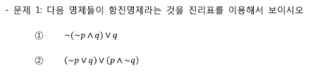
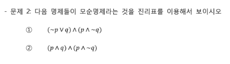
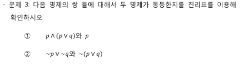
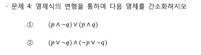
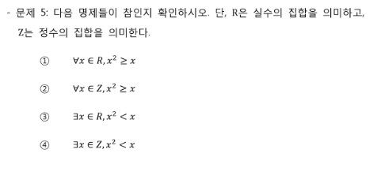
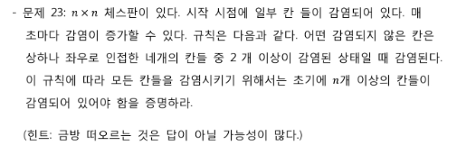

# 190930_Computational_Thinking


### 0. 프로그래밍과 논리/수학

- 명제식

  - `p -> q`

  - `q -> p` : 역

  - `~p -> ~q`: 이

  - `~q -> ~p`: 대우

    <br>

- **명제식의 진리표**★ (암기)

  ```
	p,	q,	 p->q,	~p->~q,	pVq(논리합),	p^q(논리곱)
  T	T		T		T		T			T
  T	F		F		T		T			F
  F	T		T		F		T			F
  F	F		T		T		F			F
  ```

<br>

### 1. 논리와 증명

- 항진명제: 항상 참이다.
- 모순명제: 항상 거짓이다.
- 논리동치
  - 항등법칙
  - 분배법칙★
  - 드모르간의 법칙★

<br>

문제1.

```

```


문제2.

```

```


문제3.

```

```


문제4. 

```
① (p^~q)V(p^q) = p^(~qVq)
			   = p^T = p
② (pV~q)^(~pV~q) = (q^~p)^(q^p)
				 = q^(~p^p)
				 = q^F = F
```

문제5. 

```

```

문제6. n이 짝수이면 3n + 5는 홀수임을 증명하라.

```
6k + 5 = 2(3k + 2) + 1
```

문제7. n이 홀수이면 n**2 + n은 짝수임을 증명하라.

```
(2k+1)**2 + (2k+1) = 4k**2 + 4k + 1 + 2k + 1
				   = 2(2k**2 + 3k + 1)
```
문제8. m이 짝수이고 n이 홀수이면 2m + 3n은 홀수임을 증명하라.

```
2(2k) + 3(2k+1) = 4k + 6k + 3
				= 2(5k + 1) + 1

```
문제9. 자연수n에 대해 n**2 + 5가 홀수이면 n은 짝수임을 증명하라.
```
(대우를 증명)
(2k+1)**2 + 5 = 4k**2 + 4k + 6
			  = 2(2k**2 + 2k + 3)
```
문제10. n**2이 짝수이면 n은 짝수임을 증명하라.

```
(대우를 증명)
(2k+1)**2 = 4k**2 + 4k + 1
		  = 2(2k**2 + 2k) + 1
```
문제 11. 자연수 n에 대해 n**2 + 5n + 3은 항상 홀수임을 증명하라.

```
(경우를 나누어 증명)
n이 짝수인 경우
4k**2 + 10k + 2 + 1 = 2(2k**2 + 5k + 1) + 1
n이 홀수인 경우
(2k+1)**2 + 5(2k+1) + 3 = 4k**2 + 4k + 1 + 10k + 5 + 3
						= 2(2k**2 + 7k + 4) + 1
```
문제 12. n**2이 3의 배수이면 n은 3의 배수임을 증명하라.

```
(대우로 증명)
n이 3k+1
9k**2 + 6k + 1 = 3(3k**2 + 2k) + 1
n이 3k+2
9k**2 + 12k + 3 + 1 = 3(3k**2 + 4k + 1) + 1
```
문제13. n이 홀수이면 n**2를 8로 나눈 나머지는 1임을 증명하라.★

```
(8로 나누어 떨어지도록)
n이 4k+1
16k**2 + 8k + 1 = 8(2k**2 + k) + 1
n이 4k+3
16k**2 + 24k + 8 + 1 = 8(2k**2 + 3k +1) + 1
```
문제14. 어떤 자연수를 제곱하여도 그 결과를 3으로 나눈 나머지는 2가 아님을 증명하라.★

```
어떤 자연수 3k, 3k+1, 3k+2
9k**2 = 3(3k**2)
9k**2 + 6k + 1 = 3(3k**2 + 2k) + 1
9k**2 + 12k + 4 = 3(3k**2 + 4k + 1) + 1
```
문제15. (귀류법) 유리수와 무리수의 합은 무리수임을 증명하라.★

```
통과.
```
문제16. √2는 무리수임을 증명하라.★
```
√2 = b/a
2a**2 = b**2	-> b**2와 b는 짝수이다 (문제10)
2a**2 = (2k)**2 = 4k**2		-> b**2는 4k**2이므로 1이될 수 없음(짝수가 확실)
							-> a**2와 a도 짝수이다 (문제10)
							
b/a = 2k/2k 	-> 그러므로 둘다 2로 나누어 떨어진다
즉, a와 b는 서로소에 모순되므로 기약분수로 표현되지 않는 무리수이다. (유리수가 아님)
```
문제17. log2 5는 무리수임을 증명하라.★
```
log2 5 = b/a (a, b는 서로소)
2**b/a = 5
2**b = 5**a
조건에 만족하는 자연수는 존재하지 않는다. 그러므로 무리수이다.
```
문제18. (수학적귀납법) 1+2+3+...+n = n(n+1)/2임을 증명하라.★

```
n이 1일 때 1(1+1)/2 = 1이므로 성립한다.

n = k일 때 성립한다고 가정하면
1+...+k = k(k+1)/2

n = k+1
1+...+k+(k+1) = k(k+1)/2 +(k+1)
			  = ((k+1)k + 2(k+1))/2
			  = (k**2 + 3k +2)/2 
			  = (k+1)(k+2)/2

오른쪽 식에 k+1을 넣으면 (k+1)(k+1+1)/2
```
문제19. 1** 2 + 2** 2 + 3** 2 + ...+ n**2 = n(n+1)(2n+1)/6임을 증명하라.(위와 비슷)★
```
n이 1일 때 1*(1+1)*(2*1+1)/6 = 1이므로 성립한다.

n = k일 때 성립한다고 가정하면
1+...+k**2 = k(k+1)(2k+1)/6

n = k+1
1+...+k**2+(k+1)**2 = k(k+1)(2k+1)/6 + (k+1)**2
					= 
					= 
					= (k+1)(k+2)(2k+3)/6
```
문제20. ★(암기)

```
S = r**0 + r**1 +...+ r**n
rS = r**1 + r**2 +...+ r**n + r**(n+1)

S - rS = r**0 - r**(n+1)
(1-r)S = r**0 - r**(n+1)

즉, S = (r**(n+1) - 1) / r-1 (r!=1)
```
문제21. 2이상의 모든 자연수 n에 대해 n**3 - n은 6으로 나누어 떨어짐을 증명하라.★
```
n(n-1)(n+1)
연속한 세수니까 반드시 짝수와 3의 배수가 있다.
```
문제22.

```
답안 제출에 마땅한 방법이 없으므로 통과.
```
문제23.
```

```
