# 191001_Computational_Thinking


### 2. 논리와 증명

- log n이란?★
  - 2의 몇 승이 n이 되느냐의 답
  - n을 표현하는 데 몇 비트가 필요한가의 답
  - 1로 시작해서 계속 두 배를 할 때 몇 번 하면 n이 되느냐의 답
  - n을 2로 계속 나눌 때 몇 번 나누면 거의 1이 되느냐에 대한 답

- 로그법칙★
  
  - 상수, 지수, 덧셈, 뺄셈, 밑변환, 역수 법칙
  
  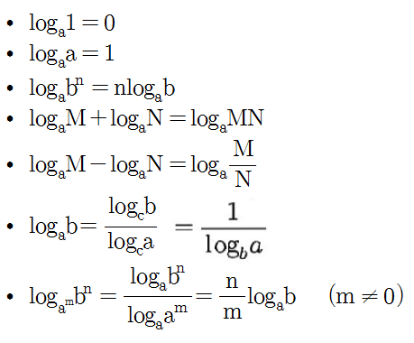

<br>

-문제1. 2진수 표현에서 log n 비트로 표현할 수 있는 숫자 범위는?

```
ex. 3자리 비트 => 2**3가지
즉, 2**log n = n가지가 된다.
```

-문제2. 스무고개가 이상적으로 진행된다고 할 때, 맞출 수 있는 답의 종류는 몇 가지인가?

```
2**20가지
```

 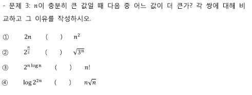

```
<
< (2**n/2, 3**n/2)
> (n**n, n!)
< (2n*log2, n*√n) => (2, √n)
```

 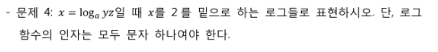

```
(log y+log z)/log a
```

 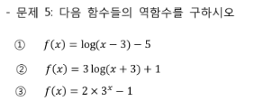

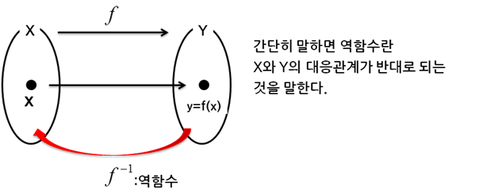

```
① y+5 = log(x-3)
2**(y+5) = x-3
2**(y+5) + 3 = x
f-1(x) = 2**(x+5) + 3

② (y-1)/3 = log(x+3)
2**(y-1)/3 = x+3
f-1(x)= 2**(x-1)/3 - 3

③ y+1 = 2*(3**x) 
(y+1)/2 = 3**x
log3 (y+1)/2 = x
f-1(x) = log3 (x+1) - log3 2
```

<br>

### 3. 집합과 조합론

 

```
둘 중 하나라도 있으면 두 집합은 다른 것
```

 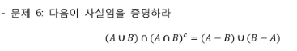

```
벤다이어그램 이용
```

 

```
64C2
```

 

```
2**n = nC0 + nC1 + ... + nCn 
```


 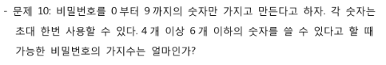

```
(10*9*8*7) + (10*9*8*7*6) + (10*9*8*7*6*5)
```

 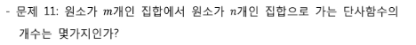

```
단사함수:1대1함수
(단, n>=m)
nPm = n*(n-1)*...*(n-m+1)*1
	= n!/(n-m)!
```

 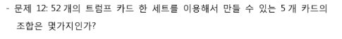

```
52C5 = 2,598,960‬
```

 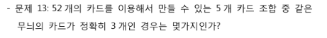

```
같은 무늬 3장을 고르고, 다른 무늬의 카드 2장을 고른다.
4C1 * 13C3 * 3C2 * 13C1 * 13C1 = 580,008
(무늬1개, 3장, 무늬2개, 1장, 1장)
```

-문제14. x+y+z = 100의 자연수 해는 몇가지인가?

```
(중복조합)
x, y, z 범위를 나누어야 하므로 나눌 수 있는 곳 99개 중에서 2개의 조합을 구한다.
99C2 = 4,851
```

 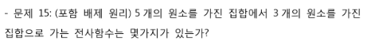

```
3**5 + (3C2*(2**5) - 3*2) - 3C1 
= 243 - 90 - 3 = 150
```

 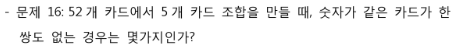

```
13C5 * (4**5) = 
(숫자, 무늬)
```

 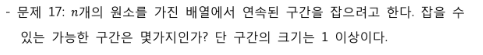

```
nC2 + n
(범위 처음, 끝 2개 조합 + 범위 1인 경우)
```

<br>

### 4. 기초 수식 

(시험)★

-문제1. T(n) = T(n-1) + **1**

```
T(n) = T(n-1) + 1
	 = T(n-2) + 1 + 1
	 = T(1) + 1 +...+ 1
	 
T(n) = O(n)
```

-문제2. T(n) = T(n-1) + **n**

```
T(n) = T(n-1) + n
	 = T(n-2) + (n-1) + n
	 = T(1) +...+ (n-1) + n
	 = 1 +...+ (n-1) + n
	 = n(n+1)/2
	 
T(n) = O(n**2)
```

-문제3. T(n) = T(n-1) + **log n**

```
T(n) = T(1) + log n + log n-1 + log n-2 +...+ log 2
	 <= T(1) + log n + log n + log n +...+ log n
	 <= T(1) + nlog n
	 
T(n) = O(nlog n)
```

-문제4. T(n) = T(n/2) + 1

```
T(n) = T(n/2) + 1
	 = (T(n/4)+1) + 1
	 2**x = n
	 x = log n
	 
T(n) = O(log n)
```

-문제5. T(n) = T(n/2) + n

```
T(n) = T(n/2) + n
	 = (T(n/4)+n/2) + n
	 
T(n) = O(n)	
```

(참고)

-문제6. T(n) = 2T(n/2) + n

```
T(n) = O(nlog n)
```

-문제7. T(n) = 3T(n/2) + n

```
T(n) = O(n**log 3)
```

-문제8. T(n) = T(n-1) + 1/n

```
T(n) = O(log n)
```

-문제9. T(n) = T(n/2) + T(n/4) + T(n/6) + T(n/12) + 1

```
T(n) = O(n)
```

-문제10. T(n) = √n* T(√n) + n

```
T(n) = O(nlog n(log n))
```

<br>

### 5. 재귀

-문제1. 피보나치 수열: F(n) = F(n-1) + F(n-2), F(1) = F(2) = 1

```
T(n) = T(n-1) + T(n-2) + 1
	 < 2T(n-1) + 1
	 
T(n) = O(2**n) 
깊이가 n번 2개씩 계속 늘어난다
```

-문제2. Merge Sort: 크기 n인 배열을 입력받아, 배열을 절반으로 두개로 나눈 후, 

 각 작은 배열을 재귀적으로 정렬후, 그 결과를 Merge 한다.

```
T(n) = O(nlog n)
깊이가 n번 절반으로 줄어든다
```

 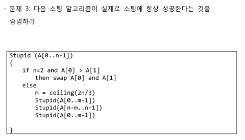

```
생략.
```

-문제4. 위의 소팅 알고리즘에서 수행하는 Swap 의 횟수는 최대 몇번인가?

```
T(n) = O(n**2.7)
```

 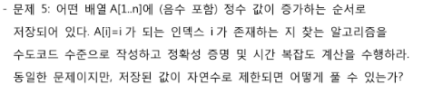

```

```

<br>

### 6. 동적 프로그래밍