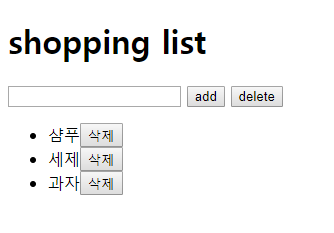

## 191030_JavaScript_intro(2)

<br>

## 1) 배열함수

> 06_array_method

### 1. forEach [참고](https://developer.mozilla.org/ko/docs/Web/JavaScript/Reference/Global_Objects/Array/forEach)

- `forEach()` 메서드는 주어진 함수를 배열 요소 각각에 대해 실행합니다. (반환값 undefined)

```js
let colors = ['red', 'green', 'blue']

// for문으로 array 돌기
for (let color of colors) {
    console.log(color)
}

// forEach문으로 array 돌기(더 편리하다.)
colors.forEach(function(color){
    console.log(color)
})

// forEach문 callback 함수구성: function(currentValue, index(optional), array(optional))
colors.forEach(function(color, idx, array){
    console.log(color, idx, array)
})
// red 0 [ 'red', 'green', 'blue' ]
// green 1 [ 'red', 'green', 'blue' ]
// blue 2 [ 'red', 'green', 'blue' ]


// function(){}는 ()=>{}와 같다.(arrow function)
colors.forEach((color)=>{console.log(color)})

colors.forEach(color => {console.log(color)}) // 소괄호 생략(매개변수가 하나)

colors.forEach(color => console.log(color)) // 중괄호 생략(표현식이 하나)


// 예제1. 각각의 post와 id, title 출력하기
// function handlePosts(){ // 함수 생략가능
    const posts = [
        {id: 50, title: 'javascript'},
        {id: 100, title: 'python'},
        {id: 123, title: 'css'}
    ]
    // for (let i = 0; i < posts.length; i++) {
    //     console.log(posts[i])
    //     console.log(posts[i].id)
    //     console.log(posts[i].title)
    // }
    posts.forEach(post=>{
        console.log(post)
        console.log(post.id)
        console.log(post.title)
    })
// }
// handlePosts()


// 예제2. image의 넓이를 areas에 넣어 출력하기
const images = [
    {height: 10, width: 20},
    {height: 14, width: 25},
    {height: 50, width: 15}
]
const areas = []

// 1. arrow function
// images.forEach(image=>{
//     areas.push(image.height*image.width)
// })

// 2. function keyword
images.forEach(function(image){
    areas.push(image.height*image.width)
})

console.log(areas)
// [ 200, 350, 750 ]
```

### 2. map [참고](https://developer.mozilla.org/ko/docs/Web/JavaScript/Reference/Global_Objects/Array/map)

- `map()` 메서드는 배열 내의 모든 요소 각각에 대하여 주어진 함수를 호출한 결과를 모아 새로운 배열을 반환합니다.

```js
const numbers = [1,2,3,4,5]
const doubleNumbers = []

// 1. forEach문 이용
numbers.forEach(number=>{
    doubleNumbers.push(number*2)
})
console.log(doubleNumbers) // [ 2, 4, 6, 8, 10 ]

// 2-1. map이용(function keyword))
const double = numbers.map(function(number){
    return number*2
})

// 2-2. map이용(arrow function))
const double = numbers.map(number => number*2)
console.log(double) // [ 2, 4, 6, 8, 10 ]


// map 응용
const images = [
    {height: 10, width: 20},
    {height: 14, width: 25},
    {height: 50, width: 15}
]

const areas = images.map(image => image.height * image.width)
console.log(areas) // [ 200, 350, 750 ]
```

### 3. filter [참고](https://developer.mozilla.org/ko/docs/Web/JavaScript/Reference/Global_Objects/Array/filter)

- `filter()` 메서드는 주어진 함수의 테스트를 통과하는 모든 요소를 모아 새로운 배열로 반환합니다.

```js
const numbers = [1,2,3,4,5]

// filter callback 함수구성 : function(currentValue, index(optional), array(optional))

const evenNumber = numbers.filter(function(number){
    return number % 2 === 0
})
console.log(evenNumber) // [ 2, 4 ]

const products = [
    {name: 'cucumber', type: 'vegetble'},
    {name: 'banana', type: 'fruit'},
    {name: 'carrot', type: 'vegetable'},
    {name: 'apple', type: 'fruit'}
]
// filter이용
const fruits = products.filter(product => {
    return product.type === 'fruit'
})
console.log(fruits) // [ { name: 'banana', type: 'fruit' }, { name: 'apple', type: 'fruit' } ]

// map이용
const fruits = products.map(product => {
    return product.type === 'fruit'
})
console.log(fruits) // [ false, true, false, true ]
```

### 4. reduce [참고](https://developer.mozilla.org/ko/docs/Web/JavaScript/Reference/Global_Objects/Array/Reduce)

- `reduce()` 메서드는 배열의 각 요소에 대해 주어진 리듀서(reducer) 함수를 실행하고, 하나의 결과값을 반환합니다.

```js
// filter callback 함수구성 : function(accumulator, currentValue, index(optional), array(optional))
// 단, 뒤에 초기값 설정해줘야 한다.(optional) 초기값을 제공하지 않으면 배열의 첫 번째 요소를 사용합니다.

const scores = [100,80,88,92,95,70]
const res = scores.reduce((total, score)=>{
    return total += score
}, 0)
const total = scores.reduce((total, score)=>total += score, 0)
console.log(res) // 525
```

### 5. find [참고](https://developer.mozilla.org/ko/docs/Web/JavaScript/Reference/Global_Objects/Array/find)

- `find()` 메서드는 주어진 판별 함수를 만족하는 첫 번째 요소의 값을 반환합니다. 그런 요소가 없다면 undefined를 반환합니다.

```js
const users = [
    {name: 'change', location: 'gj'},
    {name: 'justin', location: 'gm'},
    {name: 'tak', location: 'dj'},
    {name: 'junho', location: 'dj'},
    {name:'neo', location: 'so'}
]

const user = users.find(function(user){
    return user.name === 'neo'
})
console.log(user) // { name: 'neo', location: 'so' }
const user = users.find(function(user){
    return user.location === 'dj'
})
console.log(user) // { name: 'tak', location: 'dj' }
```

<br>

## 2) Event [참고](https://developer.mozilla.org/ko/docs/Web/API/Event)

> 07_event.html

```html
<body>
  <div id="my">

  </div>
  <button id="this-button">click!!!</button>

  <script>
    // 1. 무엇을 => id가 this-button 버튼을
    const btn = document.querySelector('#this-button')
    // console.log(btn)
    // 2. 언제 => 클릭하면
    btn.addEventListener('click', function(event){
      // console.log(event)
      // 3. 어떻게 => id가 my인 div에 hello를 넣기
      const div = document.querySelector('#my')
      div.innerHTML = '<h1>hello!!!</h1>'
    })
  </script>
</body>
```

<br>

## 3) 예제_Dino [참고](https://github.com/wayou/t-rex-runner)

> 브라우저의 dino를 상하좌우로 키보드조작시켜보기

```html
  <body>
    <div class="bg">
      
    </div>

    <script>
      // 1. 무엇을
      const dino = document.querySelector('#dino')
      // 2. 언제
      dino.addEventListener('click', function(e){
        // 3. 어떻게
        console.log('아야!!!!')
      })
      let x = 0
      let y = 0
      // 1. 무엇을
      // 2. 언제
      // keydown(키보드를 누를 때) / keypress(키보드가 눌려진동안) / keyup(키보드를 땠을때)
      document.addEventListener('keydown', e=>{
        // console.log(e)
        // 3. 어떻게
        if (e.code === 'ArrowLeft') {
          if (dino.x > 0) {
            x = x-20
            dino.style.marginLeft = `${x}px`
          }
        }else if (e.code === 'ArrowRight') {
          if (dino.x < document.documentElement.clientWidth) {
            x = x+20
            dino.style.marginLeft = `${x}px`
          }
        }else if (e.code === 'ArrowUp') {
          y = y-20
          dino.style.marginTop = `${y}px`
        }else if (e.code === 'ArrowDown') {
          y -= 50
          dino.style.marginTop = `${y}px`
        }else {
          console.log('잘못된 입력')
        }
      })
    </script>
  </body>
```

<br>

## 4) 예제_Shopping list

> 입력받아 Shopping list를 만들어보기 (+전체삭제)



```html
<body>
  <h1>shopping list</h1>
  <input id="item-input" type="text">
  <button id="add-button">add</button>
  <button id="delete-button">delete</button>
  <ul id="shopping-list">
    <!-- <li>샴푸</li>
    <li>세제</li> -->
  </ul>
  <script>
    // 1. input 태그 찾기
    const input = document.querySelector('#item-input')
    // 2. button 태그 찾기
    const button = document.querySelector('#add-button')
    // 3. ul 태그 찾기
    const ul = document.querySelector('#shopping-list')

    button.addEventListener('click', function(e){
      // 사용자가 입력한 데이터 가져오기
      const itemValue = input.value
      input.value = ''

      // 데이터를 이용해서 li태그로 묶어주기
      // <li>과자</li>
      const tag = document.createElement('li')
      tag.innerText = itemValue

      // li태그 취소선 이벤트 추가
      tag.addEventListener('click', function(e){
        if (tag.style.textDecoration == 'line-through') {
          tag.style.textDecoration = 'none'
        }else {
          tag.style.textDecoration = 'line-through'
        }
      })

      // ul태그의 자식요소로 tag를 추가
      ul.appendChild(tag)
      
      // 삭제버튼 생성
      const deleteBtn = document.createElement('button')
      deleteBtn.innerText = '삭제'

      // 삭제 버튼 이벤트 추가
      deleteBtn.addEventListener('click', function(e){
        console.log(e)
        tag.remove()
      })
      
      // 삭제버튼을 tag의 자식요소로 추가
      tag.appendChild(deleteBtn)

      // 전체삭제 버튼 생성
      const button2 = document.querySelector('#delete-button')
      button2.addEventListener('click', function(e){
        document.querySelector('#shopping-list li').remove()
      })
    })
  </script>
</body>
```

<br>

## 5) kakao map

> 카카오지도에 마커 3개 찍어서 각각 같은 거리의 좌표 구하기

- 참고사이트: apimapkakao / kakaodevelopers

```html
<body>
    <div id="map" style="width:100%;height:400px;"></div>
    <!-- 버튼을 클릭함녀 세점의 위도, 경도를 콘솔에 출력 -->
    <button id="center">모여라</button>
    <!-- kakaodevelopers > 내 애플리케이션 > 설정 > 일반 > javascript키 붙여넣기 -->
    <script type="text/javascript" src="https://dapi.kakao.com/v2/maps/sdk.js?appkey=7a38d3462aa48ebfd840240a927eed3b"></script>
    <script src="./circumcenter.js"></script>


    <!-- api map kakao > wizard 붙여넣기 -->
    <script>
      // es6으로 약간 커스터마이징
      const container = document.querySelector('#map'); //지도를 담을 영역의 DOM 레퍼런스
      const options = { //지도를 생성할 때 필요한 기본 옵션
        center: new kakao.maps.LatLng(35.450701, 126.570667), //지도의 중심좌표.
        level: 3, //지도의 레벨(확대, 축소 정도)
      }
      
      const map = new kakao.maps.Map(container, options); //지도 생성 및 객체 리턴
      // 전체 마커를 저장하는 배열
      const markers = []
      let centerMarker

      // 위도와 경도 정보
      kakao.maps.event.addListener(map, 'click', function(e) {
        console.log(e.latLng.Ga, e.latLng.Ha)
        createMarker(e.latLng)
      })
      
      // 마커 생성
      const createMarker = (position) => {
        const newMarker = new kakao.maps.Marker({
          map, // map: map 생략
          position, 
        })
        markers.push(newMarker)
        newMarker.setMap(map)

        if (markers.length > 3) {
          // 마커 제거
          markers.shift().setMap(null) 
        }
        // console.log(markers)
      }

      // 1. '모여라' 버튼을 찾는다.
      const btn = document.querySelector('#center')
      // 2. 버튼을 클릭했을 때
      btn.addEventListener('click', e=>{
        // 3. markers에 저장된 정보를 콘솔에 출력한다.
        if (markers.length === 3) {
          // 외심을 구한다.
          const center = circumcenter([
            [markers[0].getPosition().Ha, markers[0].getPosition().Ga],
            [markers[1].getPosition().Ha, markers[1].getPosition().Ga],
            [markers[2].getPosition().Ha, markers[2].getPosition().Ga]
          ])
          // console.log(center)
          const position = new kakao.maps.LatLng(center[0], center[1])
          console.log(position)

          // 기존의 마커가 있다면 지우고 새로운 마커 추가
          if (centerMarker) {
            centerMarker.setMap(null)
          }
          centerMarker = new kakao.maps.Marker({
            map,
            position
          })
        }else {
          console.log('마커를 더 찍어주세요')
        }
      })

    </script>
</body>
```

- **circumcenter npm** => 세 좌표의 외심 구하는 라이브러리 => `circumcenter.js`에  복붙

