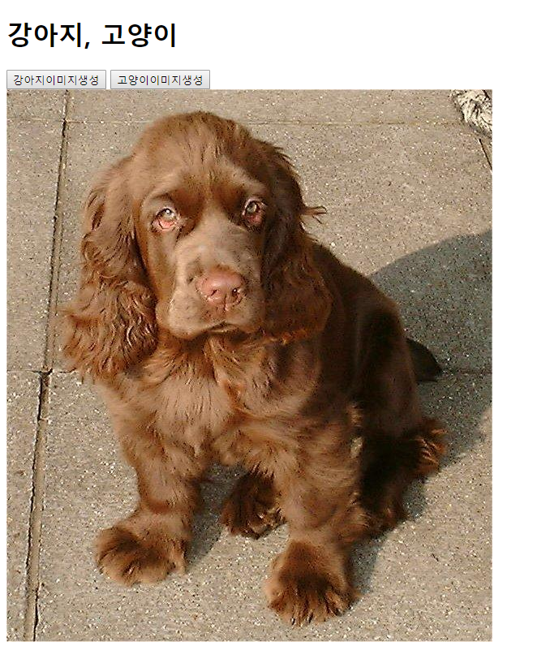

## 191031_JavaScript_API

<br>

## 1) blocking / nonblocking

- **python**: blocking

```bash
from time import sleep

def sleep_3s():
    sleep(3)
    print('wake up!')

print('start!!!!!')
sleep_3s()
print('end!!!')

# 순서 : start - wake up - end
```

- **javascript**: nonblocking

```js
console.log('start!!!')
setTimeout(()=>{console.log('wake up')}, 3000)
console.log('end!!!')

// 순서: start - end - wake up (싱글 스레드)
```

<br>

## 2) axios (비동기 ajax통신) [참고](https://github.com/axios/axios)

> 02_axios.js


```js
// axios모듈 불러온다.
const axios = require('axios') 

// axios: HTTP요청으로 데이터를 가져올 수 있다.(비동기 ajax통신)
// 결과값은 Promise { <pending> }객체, 이를 then과 catch로 분기처리할 수 있다.
axios
    .get('http://jsonplaceholder.typicode.com/postss') 
    // 정상적인 요청에 대한 응답
    .then((response)=>{
        console.log(response)
    }) 
     // 비정상적인 요청 에러
    .catch((error)=>{
        console.log(error)
    })
```

<br>

## 3) 예제_강아지, 고양이 랜덤사진 띄우기



> 03_dogs_and_cats.html

```html
<body>
  <h1>강아지, 고양이</h1>
  <button id="dogImage">강아지이미지생성</button>
  <button id="catImage">고양이이미지생성</button>
  <div class="animals"></div>

  <!-- axios 설정 -->
  <script src="https://unpkg.com/axios/dist/axios.min.js"></script>
  <script>
    const dogImagebtn = document.querySelector('#dogImage')
    // 강아지 이미지 생성 버튼클릭 이벤트
    dogImagebtn.addEventListener('click', ()=>{
      document.querySelector('.animals').innerHTML = '' // div 내용 제거
      getDogImage()
    })
    // 강아지 이미지 div에 생성하는 함수
    const getDogImage = () => {
      const dogUrl = 'https://dog.ceo/api/breeds/image/random' // 랜덤 강아지사진 제공(dog.ceo 사이트)
      axios
        .get(dogUrl)
        .then((response)=>{
          const dogImage = response.data.message
          const imageTag = document.createElement('img')
          imageTag.src = dogImage
          document.querySelector('.animals').appendChild(imageTag)
        })
        .catch((error)=>{
          console.log(error)
        })
    }

    const catImagebtn = document.querySelector('#catImage')
    // 고양이 이미지 생성 버튼클릭 이벤트
    catImagebtn.addEventListener('click', ()=>{
      document.querySelector('.animals').innerHTML = ''
      getCatImage()
    })
    // 고양이 이미지 div에 생성하는 함수
    const getCatImage = () => {
      const catUrl = 'https://api.thecatapi.com/v1/images/search' // 랜덤 고양이사진 제공(thecatapi.com 사이트)
      axios
        .get(catUrl)
        .then((response)=>{
          const catImage = response.data[0].url
          const imageTag = document.createElement('img')
          imageTag.src = catImage
          document.querySelector('.animals').appendChild(imageTag)
        })
        .catch((error)=>{
          console.log(error)
        })
    }
  </script>
</body>
```

<br>

## 4) 예제_facebook 좋아요

- Python 코드의 좋아요기능을 비동기처리방식으로 바꿔보기

> views.py

```python
def like(request, id):
    if request.is_ajax():
        post = get_object_or_404(Post, id=id)
        user = request.user
        # if user in post.like_users.all():
        if post.like_users.filter(id=user.id):
            post.like_users.remove(user)
            is_like = False
        else:
            post.like_users.add(user)
            is_like = True

        context = {
            'is_like': is_like, 
            'likes_cnt': post.like_users.all().count()
            }
        # Json 구조로 반환
        return JsonResponse(context)
        # return redirect('posts:index')
    else:
        return JsonResponse({'message': '잘못된 요청입니다.'})
```

> index.html

```html

  <h1>인덱스</h1>
  
    <p>{{post.user.username}}</p>
    <p>{{post.title}}</p>
    <!-- 어떤 게시물인지 알기위해 id를 지정 -->
    <p><span id="count{{post.id}}">{{post.like_users.count}}</span>명이 좋아요를 눌렀습니다.</p>
    
    
      <!-- 어떤 data인지 알기위해 data-id를 지정 => e.target안에 dataset이 생긴다. -->
      <i class="far fa-thumbs-up" data-id="{{post.id}}"></i>
    
      <i class="far fa-thumbs-down" data-id="{{post.id}}"></i>
    
    <hr>
    
    <script>
      const likeBtns = document.querySelectorAll('i')
      likeBtns.forEach(btn=>{
        btn.addEventListener('click', (e)=>{
          // console.log(e.target.classList)
          const postId = e.target.dataset.id
          console.log(postId)

          // 장고에게 좋아요 요청을 보낸다.(post)
          axios.defaults.headers.common['X-Requested-With'] = 'XMLHttpRequest' // XHR요청
          axios.defaults.xsrfCookieName = 'csrftoken' // 쿠키안의 csrftoken
          axios.defaults.xsrfHeaderName = 'X-CSRFToken' // 헤더 설정
          axios
            .post(`/posts/${postId}/like/`)
            .then(response=>{
              console.log(response.data)

              // 해당게시물의 좋아요수를 바꾼다.
              const likes_cnt = document.querySelector(`#count${postId}`)
              likes_cnt.innerText = response.data.likes_cnt
              
              // 해당게시물의 아이콘을 바꾼다.
              if (response.data.is_like) {
                e.target.classList.remove('fa-thumbs-down')
                e.target.classList.add('fa-thumbs-up')
              }else {
                e.target.classList.remove('fa-thumbs-up')
                e.target.classList.add('fa-thumbs-down')
              }
            })
            .catch(error=>{
              console.log(error)
            })
        })
      })
    </script>

```