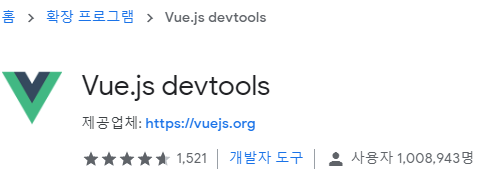
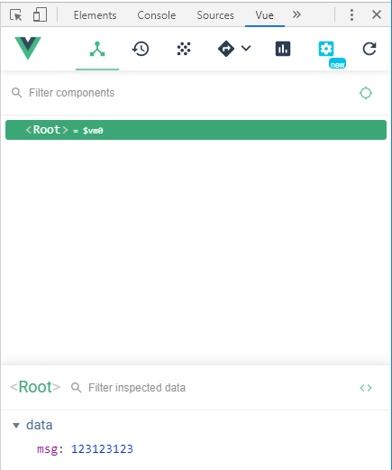
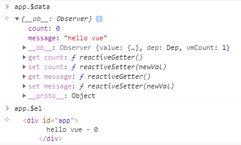
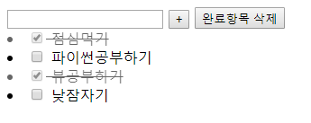

## 191104_Vue_intro

#### SPA (Single Page Application) 

> 정교한 단일 페이지 응용프로그램

- 한페이지안에서 데이터가 일부분씩 바뀐다.

- 사용자가 좀더 수월하게 접근할 수 있다.

angular > react > vue

#### Vue 디자인패턴 MVVM

- `Model`: 데이터 처리(데이터베이스와 통신)
- `View`: 사용자의 눈에 보이는 인터페이스
- `ViewModel`: View와는 Binding, Command로 연결하고, Model과는 데이터를 주고받는 역할

<br>

## Intro

#### 환경설정 [공식사이트](https://kr.vuejs.org/v2/guide/index.html)

```html
<script src="https://cdn.jsdelivr.net/npm/vue/dist/vue.js"></script>
```

#### 확장프로그램

vue 개발을 도와주는 `Vue.js devtools` 확장프로그램 추가 > 설정: 파일 URL에 대한 액세스 **허용**

> 개발자옵션에서 사용할 수 있다.






### 0. vue / javascript

> input 태그에 글자가 입력됨과 동시에 p태그에서 출력시키기

```html
<body>
  <!-- View -->
  
  <!-- 1.vue -->
  <div id="app">
    <!-- v-model: input데이터를 실시간으로 해당 변수안에 반영한다. -->
    <input id="vue-input" type="text" v-model="msg">
    <p id="vue-p">{{msg}}</p>
  </div>
    
  <!-- 2.javascript -->
  <input id="js-input" type="text">
  <p id="js-p"></p>

    
  <script src="https://cdn.jsdelivr.net/npm/vue/dist/vue.js"></script>
  <script>
    // ViewModel -> 변경되면 자동으로 View도 변경된다.

    // 1.vue
    const app = new Vue({
      // 해당 element 내부에서만 참조가 가능하다.(다른곳은 불가능)
      el: '#app',
      // object생성
      data: {
        msg: '',
      }
    })
    // 2.javascript
    const inputText = document.querySelector('#js-input')
    inputText.addEventListener('keyup', e=>{
      const text = document.querySelector('#js-p')
      text.innerText = inputText.value
    })
  </script>
</body>
```

<br>

### 1. vue 인스턴스

> 함수 사용해서 숫자 증가, 감소시켜보기 

##### 기본구조

1. `data:{}` 데이터 저장

2. `methods:{ 함수정의 }` 데이터 수정, 불러오기

```html
<body>
    <div id="app">
      {{message}} - {{count}}
    </div>
    <script src="https://cdn.jsdelivr.net/npm/vue/dist/vue.js"></script>
    <script>
      const app = new Vue({
        el: '#app',
        // 데이터 저장
        data: {
          // app.변수명으로 접근
          message: 'hello vue',
          count: 0,
        },
        // 데이터 수정, 불러오기
        methods: {
          // 1.function keyword(주로 사용할 것)
          plus: function() {
            // console.log(this) 호출하고 있는 Vue 인스턴스를 가리킨다.
            this.count++
          },
          // 2.arrow function(원하는대로 찾기 힘들다.)
          //plus2: ()=>{
          //  console.log(this) 최상위 브라우저 전체(Window)를 가리킨다.
          //}
          minus(){ // minus: function minus(){} 함수와 이름이 같으면 생략가능하다.
            this.count--
          }
        }
      })
    </script>
</body>
```

(참고) app에 들어있는 속성에 접근할 때는  $를 붙여야 한다.



<br>

### 2. 디렉티브

> 배열기반 리스트 렌더링 -> Todo 리스트 만들기



#### v-for / v-if / v-on / v-bind / v-model

```html
<head>
  <meta charset="UTF-8">
  <meta name="viewport" content="width=device-width, initial-scale=1.0">
  <meta http-equiv="X-UA-Compatible" content="ie=edge">
  <title>Document</title>
  <style>
    .completed {
      text-decoration: line-through;
      opacity: 0.6;
    }
  </style>
</head>
<body>
  <div id="app">
    <!-- Todo 리스트 만들기 -->
    
    <!-- v-model: input태그만 양방향바인딩(값변경)이 가능하다. -->
    <input type="text" v-model="newTodo" v-on:keyup.enter="addTodo">
    <button v-on:click="addTodo">+</button>
    <button v-on:click="clearCompleted">완료항목 삭제</button>

    <!-- 1.completed가 true인 항목에 '완료'표시하기 -->
    <!-- <li v-for="todo in todos" v-if="!todo.completed" v-on:click="check(todo)">
      {{todo.title}}
    </li>
    <li v-else v-on:click="check(todo)">
      {{todo.title}} [완료!!]
    </li> -->

    <!-- 2.style태그를 이용하여 완료된항목에 적용하기 -->
    <li v-for="todo in todos" v-bind:class="{completed: todo.completed}">
      <input type="checkbox" v-model="todo.completed">
      {{todo.title}}
    </li>


    <!-- (참고만) 해당태그에 바로 스타일 지정하는 법 -->
    <!-- <div v-bind:style="{ color: color, fontSize: fontSize + 'px' }">
      test
    </div> -->
  </div>
  <script src="https://cdn.jsdelivr.net/npm/vue/dist/vue.js"></script>
  <script>
    const app = new Vue({
      el: '#app',
      data: {
        // color: 'red',
        // fontSize: 30,
        newTodo: '',
        todos: [
          {
            title: '점심먹기',
            completed: true,
          },
          {
            title: '파이썬공부하기',
            completed: false,
          },
          {
            title: '뷰공부하기',
            completed: true,
          },
          {
            title: '낮잠자기',
            completed: false,
          },
        ],
      },
      methods: {
        check: function(todo){
          todo.completed = !todo.completed
        },
        addTodo() {
          // console.log(this.newTodo)
          this.todos.push({
            title: this.newTodo,
            completed: false,
          })
          this.newTodo = ''
        },
        clearCompleted() {
          this.todos = this.todos.filter(todo=>{
            return todo.completed === false
          })
        }
      }
    })
  </script>
</body>
```

<br>

### 3. 예제_강아지, 고양이 랜덤사진 띄우기

```html
<body>
  <div id="app">
    <button v-on:click="getDogImage">멍멍</button>
    <button v-on:click="getCatImage">야옹</button>
    
  </div>
  <script src="https://cdn.jsdelivr.net/npm/vue/dist/vue.js"></script>
  <!-- axios cdn -->
  <script src="https://unpkg.com/axios/dist/axios.min.js"></script>
  <script>
    const app = new Vue({
      el: '#app',
      data: {
        image: ''
      },
      methods: {
        getDogImage: function(){
          const DOG_URL = 'https://dog.ceo/api/breeds/image/random'
          axios.get(DOG_URL)
            .then((response)=>{
              // console.log(response)
              this.image = response.data.message
            })
            .catch((error)=>{
              console.log(error)
            })
        },
        getCatImage: function(){
          const CAT_URL = 'https://api.thecatapi.com/v1/images/search'
          axios.get(CAT_URL)
            .then((response)=>{
              // console.log(response)
              this.image = response.data[0].url
            })
            .catch((error)=>{
              console.log(error)
            })
        }
      }
    })
  </script>
</body>
```