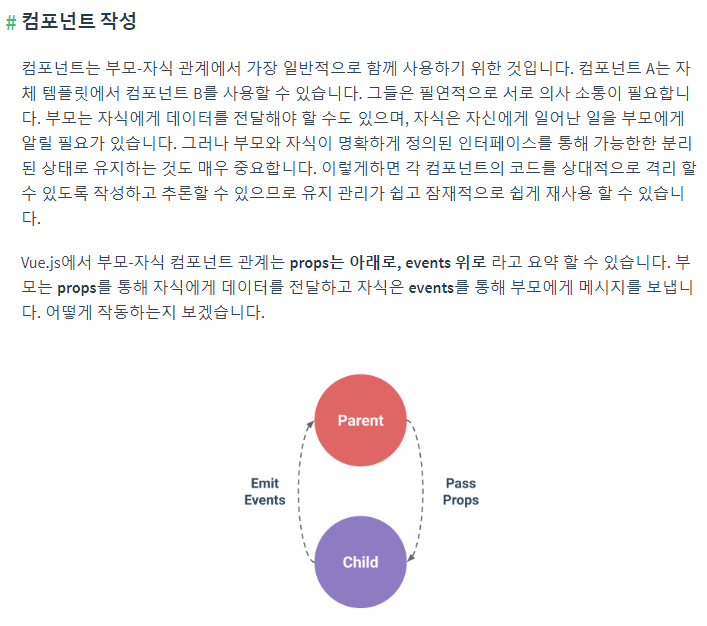

## 191106_Vue_Component

## 1. webpack (참고만)

[공식사이트](https://webpack.js.org/)

```bash
$ npm --version
$ npm install vue
$ npm install webpack-cli -D
```

파이썬과 다르게 js에서 데이터 불러오려면 내보내주는 명령이 필요하다

시작점에서 데이터를 모아서 하나의 결과물로 만들어준다.

> webpack.config.js

```js
const path = require('path')
// from path import path

module.exports = {
    entry: { // 최상단 
        app: path.join(__dirname, 'src', 'main.js')
    },
    module: {},
    plugins: [],
    output: { // 결과물
        filename: 'app.js', // 불러올 파일
        path: path.join(__dirname, 'dist') // 저장경로
    } 
}
```

<br>

## 2. Vue-cli

```bash
npm install -g @vue/cli # 설치

$ npm run serve # 실행
```



### 강아지 고양이 랜덤이미지 보여주기

dog-and-cat > src > `App.vue` 	(자동완성: vue+`tab`)

```html
<template>
  <div id="app">
    <GetImage btnName="멍멍" @getAnimalImage="getImage"/>
    <GetImage btnName="야옹" @getAnimalImage="getImage"/>
    
    <!-- 두개의 component 하나로 통합 -->
    <!-- <GetDogImage/>
    <GetCatImage/> -->
  </div>
</template>

<script>
import GetImage from './components/GetImage'
import axios from 'axios'
// import GetDogImage from './components/GetDogImage'
// import GetCatImage from './components/GetCatImage'

export default {
  name: 'app',
  components: {
    GetImage
    // GetDogImage,
    // GetCatImage,
  },
  data: function(){
    return {
      animalUrl: ''
    }
  },
  methods: {
    getImage: function(name){
      console.log(name)
      if (name==="멍멍"){
        const DOG_URL = 'https://dog.ceo/api/breeds/image/random'
        axios.get(DOG_URL)
          .then(response=>{
            this.animalUrl = response.data.message
          })
          .catch(error=>{
            console.log(error)
          })
      } else {
        const CAT_URL = 'https://api.thecatapi.com/v1/images/search'
        axios.get(CAT_URL)
          .then(response=>{
            this.animalUrl = response.data[0].url
          })
          .catch(error=>{
            console.log(error)
          })
      }
    }
  }
}
</script>
```

dog-and-cat > src > components > `GetImage.vue` 

```html
<template>
  <button v-on:click="onAnimalImage">{{btnName}}</button>
</template>

<script>
export default {
  props: {
    btnName: String,
  },
  data: function(){
    return {
    }
  }, 
  methods: {
    onAnimalImage: function(){
      // console.log(this.btnName)
      this.$emit('getAnimalImage', this.btnName) // 이벤트와 버튼이름을 보낸다.
    }
  }
}
</script>
```

