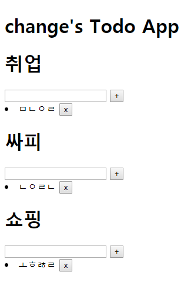

## 191105_Vue_intro(2)

[공식사이트](https://kr.vuejs.org/)

### 1. method VS computed 속성

### 2. Local Storage vs Session Storage

### 3. watch / mounted 속성

> input 태그에 글자가 입력됨과 동시에 p태그에서 출력시키기

```html
<body>
  <!-- Todo 리스트 만들기 -->
  <div id="app" v-bind:style="{ backgroundImage: 'url(' + bgImg + ')' , height: '100vh', backgroundPosition: 'center', backgroundSize: 'cover'}">

    <!--  -->
    <select v-model="status">
      <option value="all">모든항목</option>
      <option value="active">미완료항목</option>
      <option value="completed">완료항목</option>
    </select>

    <!-- v-model: input태그만 양방향바인딩(값변경)이 가능하다. -->
    <input type="text" v-model="newTodo" v-on:keyup.enter="addTodo">
    <button @click="addTodo">+</button>
    <button v-on:click="clearCompleted">완료항목 삭제</button>

    <!-- 1.completed가 true인 항목에 '완료'표시하기 -->
    <!-- <li v-for="todo in todos" v-if="!todo.completed" v-on:click="check(todo)">
      {{todo.title}}
    </li>
    <li v-else v-on:click="check(todo)">
      {{todo.title}} [완료!!]
    </li> -->

    <!-- 2.style태그를 이용하여 완료된항목에 적용하기 -->
    <li v-for="todo in computedTodosByStatus" :class="{completed: todo.completed}" v-bind:key="todo.id">
      <input type="checkbox" v-model="todo.completed">
      {{todo.title}}
    </li>
    <!-- (참고만) 해당태그에 바로 스타일 지정하는 법 -->
    <!-- <div v-bind:style="{ color: color, fontSize: fontSize + 'px' }">
      test
    </div> -->

    <!-- 입력데이터 뒤집어서 출력하기 -->
    <!-- <p>{{reverseNewTodo}}</p> -->

    <!-- method속성 vs computed속성 -->
    <!-- 둘다 결과 반환 -->
    <!-- 계속 reload vs 변수에 저장 -->
    <!-- <p>{{dateMethod()}}</p>
    <p>{{dateComputed}}</p> -->

    <!-- (참고만) -->
    <span>지금 상태는!!!! {{status}}</span>
    <span v-text="status"></span>
    <!-- html태그 랜더링 -->
    <span v-html="tag">{{tag}}</span>
    <!-- 주석처리(랜더링x) -->
    <span v-if="false">안녕하세요</span>
    <!-- display:none(랜더링o) -->
    <span v-show="false">안녕하세요</span>

  </div>

  <script src="https://cdn.jsdelivr.net/npm/vue/dist/vue.js"></script>
  <script src="https://unpkg.com/axios/dist/axios.min.js"></script>
  <script>
    // Local Storage vs Session Storage
    // 영구저장 vs 일시저장
    const STORAGE_KEY = 'vue-todo'
    const todoStorage = {
      // 함수를 변수(value)로 사용할 수 있다.
      save: function(todos){
        localStorage.setItem(STORAGE_KEY, JSON.stringify(todos)) // 데이터를 JSON형태로 저장
      },
      fetch: function(){
        // ||연산: 앞의 값이 없으면(null이면) '[]'를 반환
        return JSON.parse(localStorage.getItem(STORAGE_KEY) || '[]') // js object형태로 반환
      },
    }
    const app = new Vue({
      el: '#app',
      data: {
        // color: 'red',
        // fontSize: 30,
        newTodo: '',
        todos: [],
        status: 'all',
        bgImg: '',
        tag: '<h1>안녕하세요</h1>'
      },
      methods: {
        check: function(todo){
          todo.completed = !todo.completed
        },
        addTodo() {
          // console.log(this.newTodo)
          if (this.newTodo.length != 0){
            this.todos.push({
              id: Date.now(), // 고유값 임의지정
              title: this.newTodo,
              completed: false,
            })
          }
          this.newTodo = ''
        },
        clearCompleted() {
          this.todos = this.todos.filter(todo=>{
            return todo.completed === false
          })
        },
        todosByStatus: function(){
          let statusTodos = []
          if (this.status === "completed"){
            // 완료된 항목들만 출력
            statusTodos = this.todos.filter(todo=>{
              return todo.completed === true
            })
          } else if (this.status === "active"){
            // 미완료된 항목
            statusTodos = this.todos.filter(todo=>{
              return todo.completed === false
            })
          } else {
            statusTodos = this.todos
          }
          return statusTodos
        },
        dateMethod: function(){
          return new Date()
        }
      },

      // computed: 데이터 연산들을 정의한다.
      // (유지보수하기 좋고, 미리 변수에 연산결과를 캐싱해놓고 데이터가 변경되면 호출됨 -> 권장)
      computed: {
        // reverseNewTodo: function(){
        //   return this.newTodo.split('').reverse().join('')
        // },
        computedTodosByStatus: function(){
          let statusTodos = []
          if (this.status === "completed"){
            // 완료된 항목들만 출력
            statusTodos = this.todos.filter(todo=>{
              return todo.completed === true
            })
          } else if (this.status === "active"){
            // 미완료된 항목
            statusTodos = this.todos.filter(todo=>{
              return todo.completed === false
            })
          } else {
            statusTodos = this.todos
          }
          return statusTodos
        },
        dateComputed: function(){
          return new Date()
        }
      },

      // watch: 데이터 변화를 감지하여 자동으로 특정 로직을 수행한다.
      watch: {
        todos: {
          handler: function(todos){
            todoStorage.save(todos)
          },
          // object 내부변화도 적용한다.
          deep: true
        }
      },

      // mounted: LocalStorage와 연결되어 새로고침해도 데이터가 사라지지 않는다.
      mounted: function(){
        this.todos = todoStorage.fetch()
        const IMG_URL = 'https://source.unsplash.com/random/1600x900'
        axios.get(IMG_URL)
          .then((response)=>{
            console.log(response.request.responseURL)
            this.bgImg = response.request.responseURL
          })
          .catch((error)=>{})
      }
    })
  </script>
</body>
```

<br>

### 2. component



```html
<body>
  <div id="app">
    <h1>change's Todo App</h1>
    <!-- component이름을 태그로써 호출한다. -->
    <todo-list category="취업"></todo-list>
    <todo-list category="싸피"></todo-list>
    <todo-list category="쇼핑"></todo-list>
  </div>
  <script src="https://cdn.jsdelivr.net/npm/vue/dist/vue.js"></script>

  <script>
    Vue.component('todo-list', { // component이름
      props: ['category'], // template로 데이터를 전달하는 통로(사용자 정의 속성)
      template: `
        <div class="todo-list">
          <h1>{{category}}</h1>
          <input type="text" v-model="newTodo" v-on:keyup.enter="addTodo">
          <button v-on:click="addTodo">+</button>
          <li v-for="todo in todos" v-bind:key="todo.id">
            <span>{{ todo.content }}</span>
            <button v-on:click="removeTodo(todo.id)">x</button>
          </li>
        </div>
      `,
      data: function() {
        return {
          todos: [],
          newTodo: ''
        }
      },
      methods: {
        addTodo: function(e) {
          if (this.newTodo.length != 0) {
            this.todos.push({
              id: Date.now(),
              content: this.newTodo,
              completed: false,
            })
            this.newTodo = ''
          }
        },
        removeTodo: function(todoID) {
          this.todos = this.todos.filter(todo => {
            return todo.id !== todoID
          })
        }
      }
    })
  </script>

  <script>
    const app = new Vue({
      el: '#app',
    })
  </script>
</body>
```
