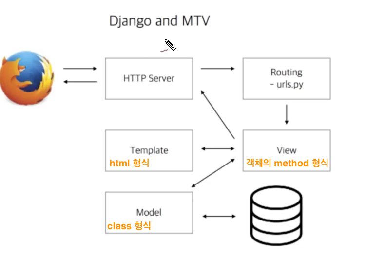

## 190805_Django

> 프레임워크 ?

: 소프트웨어를 구성하는 뼈대,  구조가 견고하면서 유지보수 비용을 줄일 수 있게 유연성있게 개발.   이를 위해 관리할 데이터와 비지니스 로직과 사용자와 상호작용하는 뷰 사이의 관계를 느슨하게 구조화하여 개발

<br>

#### Django 개발방식 디자인패턴

### MTV (Model Template View)

- model.py: 데이터를 관리 (데이터 클래스 정의)

- templates 폴더: 사용자가 보는 화면 (HTML, XML, JSON 등)

- views.py: 중간 관리자 (비즈니스 로직 작성)



<br>

#### 가상환경 설정해주기

> Python에서의 가상 환경이란?	

: 파이썬에서는 여러개의 프로젝트를 진행하게 되면 문제가 됩니다. 작업을 바꿀때마다 다른 버전의 라이브러리를 설치해야 합니다. 이를 방지하기 위해 일반적으로 프로젝트마다 다른 하나의 가상환경을 생성한 후 작업을 하게 됩니다.

### 1. git bash

```
$ python -m venv venv
대표적인 모듈 중 venv로 가상환경을 생성한다.

($ ls)
venv폴더가 생성된 것을 확인할 수 있다.

$ source venv/Scripts/activate
이곳에서 venv라는 가상환경을 구동한다. 문장끝에 (venv)가 붙는다.

($ pip list)
아무것도 없는 새로운 환경이 된 것을 확인

($ deactivate)
가상환경을 빠져나간다.
```

<br>

### 2. vscode

```
Ctrl + Shift + P
-> Select Interpreter 검색
-> Python 3.7.3 64-bit ('venv':venv) 선택

이곳에서 venv라는 가상환경을 구동한다. 문장끝에 (venv)가 붙는다.
```

>  터미널

```
($ pip list)
아무것도 없는 새로운 환경이 된 것을 확인

$ pip install django
Django 설치

($ pip list)
Django가 설치된 것을 확인

$ django-admin startproject django_intro .
현재폴더에 자동으로 프로젝트 django_intro를 생성(. 이 있어야 폴더안에 생김)

$ python manage.py runserver
서버 실행되는지 확인(로켓그림)
```

> 폴더생성 후

```
.gitignore 파일 생성 -> gitignore.io 에서 python, windows 검색 -> 복사/붙여넣기

$ django-admin startapp pages
pages 폴더가 생성됨 (views.py 들어있음)

폴더생성 후 설정
django_intro 폴더 -> settings.py 파일 -> INSTALLED_APPS 리스트 안에 'pages', 추가해주기
								LANGUAGE_CODE = 'en-us'를 'ko-kr'로 바꿔주기
								TIME_ZONE = 'UTC'을 'Asia/Seoul'로 바꿔주기
										
django_intro 폴더 -> urls.py 파일 -> from pages import views 해주기
```

> ★반복되는 흐름 (urls.py -> views.py -> templates)

```
1. django_intro 폴더 -> urls.py 파일 -> from pages import views 해주기
								urlpatterns 리스트 안에 path('index/', views.index), 추가해주기

2. pages 폴더 -> views.py 파일 -> def index(request):
    					return render(request, 'index.html') 적어주기
3. pages 폴더 -> templates 폴더 만들기 -> index.html 파일 만들기
```
