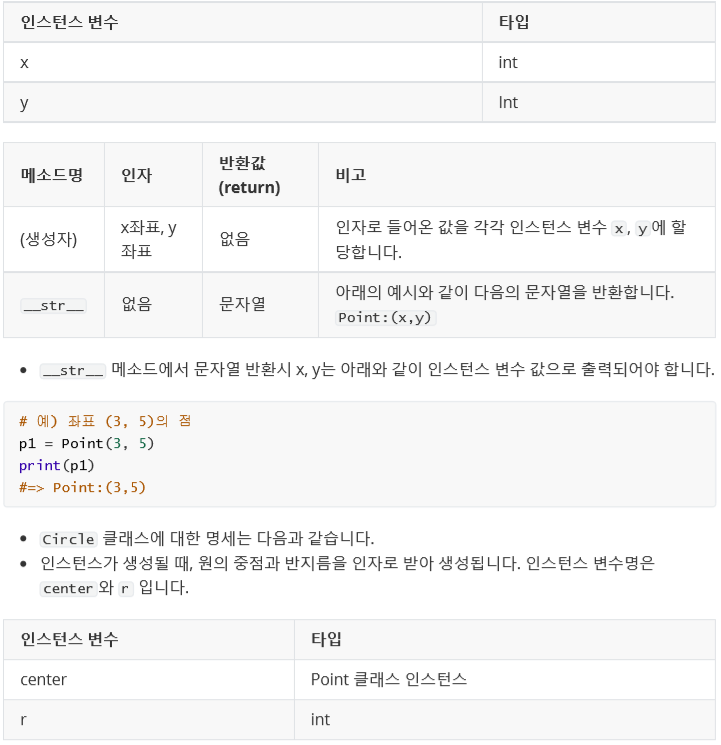
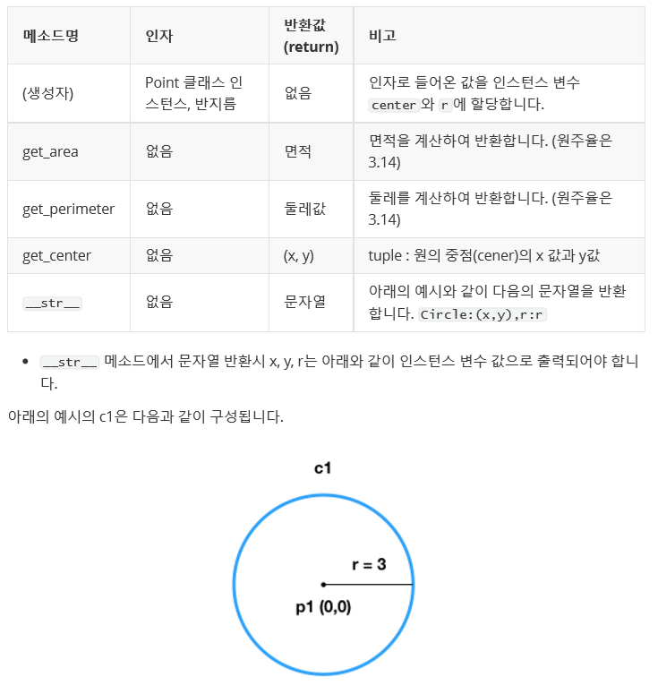

## 190801_python_월말평가 예시

<br>

### 문제 1. 이상한 덧셈 - ex01.py

- 리스트 numbers에 담겨있는 숫자들 중 양의 정수들의 합을 반환하는 `positive_sum` 함수를 작성하시오.

```python
# 파일명 및 함수명을 변경하지 마시오.
def positive_sum(numbers):
    return sum([number for number in numbers if number > 0])


# 실행 결과를 확인하기 위한 코드입니다. 수정하지 마시오.
if __name__ == '__main__':
    print(positive_sum([1, -4, 7, 12])) #=> 20
    print(positive_sum([-1, -2, -3, -4])) #=> 0
```

### 문제 2. 문자열 계산하기 - ex02.py

- 수식 문자열이 주어졌을 때, 이를 계산해주는 `calc` 함수를 작성하시오.
- 이 계산기는 덧셈과 뺄셈만 가능하다.

```python
# 파일명 및 함수명을 변경하지 마시오.
def calc(eqution):
    # 1.
    # plus_split = eqution.split('+')
    # res = 0
    # for i in plus_split:
    #     if i == '':
    #         continue
    #     minus_split = i.split('-')
    #     if minus_split[0] != '':
    #         res += int(minus_split[0])
    #     if len(minus_split) == 2:
    #         res -= int(minus_split[1])
    # return res

    # 2. 짧은 코드
    return sum(list(map(int, ('0'+eqution).replace('-','+-').split('+'))))


# 실행 결과를 확인하기 위한 코드입니다. 수정하지 마시오.
if __name__ == '__main__':
    print(calc('123+2-124'))
    print(calc('-12+12-7979+9191'))
    print(calc('+1-1+1-1+1-1+1-1+1-1+1-1+1-1+1-1+1-1+1-1+1-1+1-1+1-1+1-1+1-1+1-1'))
```

### 문제 3. 도형 만들기 - ex03.py

- `Point` 와 `Circle` 클래스를 활용하여 꼭지점과 원을 표현하시오.






```python
class Point:
    def __init__(self, x, y):
        self.x = x
        self.y = y
    def __str__(self):
        return f'Point:{(self.x,self.y)})'
    
class Circle:
    def __init__(self, center, r):
        self.center = (center.x,center.y)
        self.r = r
    def get_area(self):
        return self.r * self.r * 3.14
    def get_perimeter(self):
        return 2 * self.r * 3.14
    def get_center(self):
        return self.center
    def __str__(self):
        return f'Circle:{self.center},r:{self.r}'
    
    

# 실행 결과를 확인하기 위한 코드입니다. 수정하지 마시오.
if __name__ == '__main__':
    p1 = Point(0, 0)
    c1 = Circle(p1, 3)
    print(c1.get_area())
    print(c1.get_perimeter())
    print(c1.get_center())
    print(c1)
    p2 = Point(4, 5)
    c2 = Circle(p2, 1)
    print(c2.get_area())
    print(c2.get_perimeter())
    print(c2.get_center())
    print(c2)
```
