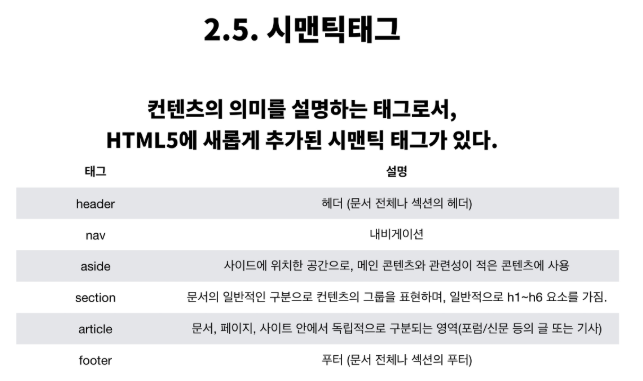
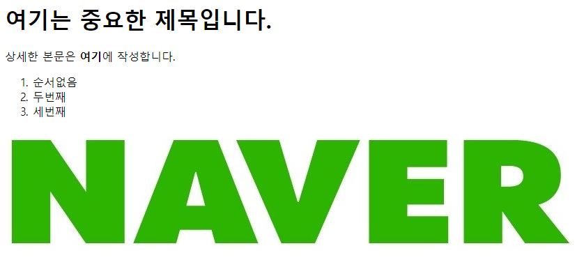
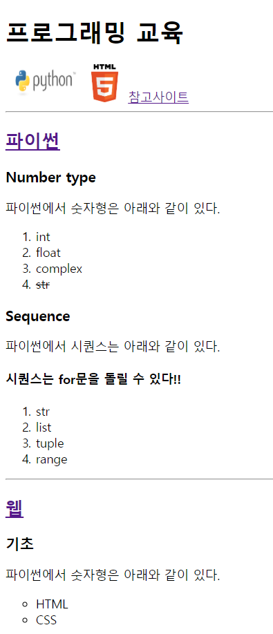
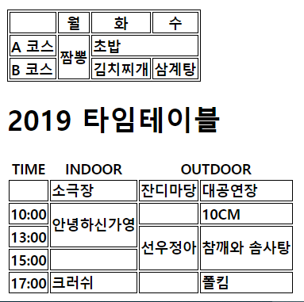
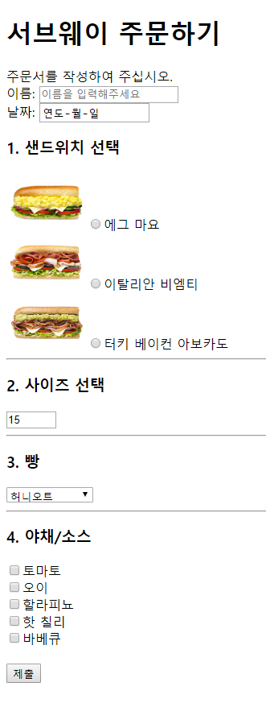

## 190729_Web_HTML

### 1. 이론

> HTML: Hyper Text Markup Language

> HTTP(S): Hyper Text를 주고받는 규칙(Transfer Protocol)

##### 요소

- 태그 + 내용  `<h1> 내용 </h1>`

##### Self - closing 요소

- ``

##### 속성

- 속성명=''속성값''  `<a href='google.com'/>`

- id, class, style은 태그와 상관없이 모두 사용 가능

##### DOM 트리

- 태그는 중첩되어 사용가능

- **부모-자식관계 혹은 형제관계**

##### 시맨틱태그

- 의미를 가지는 태그들

  (non semantic요소: div, span 등)



<br>

### 2. 실습


> intro.html

```html
<!-- 여기는 주석입니다. -->
<h1>여기는 중요한 제목입니다.</h1>
<p>상세한 본문은 <b>여기</b>에 작성합니다.</p>

<ol>
    <li>순서없음</li>
    <li>두번째</li>
    <li>세번째</li>
</ol>

<a href="https://naver.com">
    
</a>
```


> index.html
```html
<body>
	<h1>프로그래밍 교육</h1>
    <a href="#python"></a>
    <a href="#web"></a>
    <a href="intro.html">참고사이트</a>
    <hr>
    <h2 id="python"><a href="https://docs.python.org/ko/3/tutorial/index.html" target="_blank">파이썬</a></h2>
    <h3>Number type</h3>
    <p>파이썬에서 숫자형은 아래와 같이 있다.</p>
    <ol>
        <li>int</li>
        <li>float</li>
        <li>complex</li>
        <li><del>str</del></li>
    </ol>

    <h3>Sequence</h3>
    <p>파이썬에서 시퀀스는 아래와 같이 있다.</p>
    <h4>시퀀스는 for문을 돌릴 수 있다!!</h4>
    <ol>
        <li>str</li>
        <li>list</li>
        <li>tuple</li>
        <li>range</li>
    </ol>
    <hr>
	
    <h2 id="web"><a href="https://developer.mozilla.org/ko/">웹</a></h2>
    <h3>기초</h3>
    <p>파이썬에서 숫자형은 아래와 같이 있다.</p>
    <ul>
        <li style="list-style-type: circle">HTML</li>
        <li style="list-style-type: circle">CSS</li>
    </ul>
</body>
```

- **emmet** 으로 HTML태그 작성하기

  리스트 : `ol>li*4` + `Tab`

  테이블 : `table>tr>td*4` + `Tab`



> index.html
```html
<style>
    .lunch{
        border: 1px solid black;
        border-collapse: separate;
    }
    .lunch th{
        border: 1px solid black;
    }
    td{
        border: 1px solid black;
        font-weight: bold;
    }
</style>
```


```html
<body>
	<table class='lunch'>
        <thead>
            <th></th>
            <th>월</th>
            <th>화</th>
            <th>수</th>
        </thead>
        <tbody>
            <tr>
                <td>A 코스</td>
                <td rowspan="2">짬뽕</td>
                <td colspan="2">초밥</td>
            </tr>
            <tr>
                <td>B 코스</td>
                <td>김치찌개</td>
                <td>삼계탕</td>
            </tr>
        </tbody>
    </table>

    <h1>2019 타임테이블</h1>
        <table>
            <thead>
                <th>TIME</th>
                <th>INDOOR</th>
                <th colspan="2">OUTDOOR</th>
            </thead>
            <tbody>
                <tr>
                    <td></td>
                    <td>소극장</td>
                    <td>잔디마당</td>
                    <td>대공연장</td>
                </tr>
                <tr>
                    <td>10:00</td>
                    <td rowspan="2">안녕하신가영</td>
                    <td></td>
                    <td>10CM</td>
                </tr>
                <tr>
                    <td>13:00</td>
                    <td rowspan="2">선우정아</td>
                    <td rowspan="2">참깨와 솜사탕</td>
                </tr>
                <tr>
                    <td>15:00</td>
                    <td></td>
                </tr>
                <tr>
                    <td>17:00</td>
                    <td>크러쉬</td>
                    <td></td>
                    <td>폴킴</td>
                </tr>
            </tbody>
        </table>
</body>
```




> subway.html
```html
<style>
    p{
        margin: 0;
    }
</style>
```

```html
<body>
    <h1>서브웨이 주문하기</h1>
    <p>주문서를 작성하여 주십시오.</p>
    <form action="">
        <p><label for="name">이름:</label>
        <input id="name" type="text" name="name" placeholder="이름을 입력해주세요"></p>
        <p><label for="date">날짜:</label>
        <input id="date" type="date" name="date"></p>

        <h3>1. 샌드위치 선택</h3>
        <p><input type="radio" name="menu" value="1"><label for="option1">에그 마요</label></p>
        <p><input type="radio" name="menu" value="2"><label for="option2">이탈리안 비엠티</label></p>
        <p><input type="radio" name="menu" value="3"><label for="option3">터키 베이컨 아보카도</label></p>
        <hr>

        <h3>2. 사이즈 선택</h3>
        <input type="number" name="size" min="15" max="30" step="15" value="15">
        <hr>

        <h3>3. 빵</h3>
        <select name="bread" id="">
            <option value="1">허니오트</option>
            <option value="2" disabled="disabled">플랫브래드</option>
            <option value="3">하티 이탈리안</option>
        </select>
        <hr>

        <h3>4. 야채/소스</h3>
        <p><input type="checkbox" name="source" value="1">토마토</p>
        <p><input type="checkbox" name="source" value="2">오이</p>
        <p><input type="checkbox" name="source" value="3">할라피뇨</p>
        <p><input type="checkbox" name="source" value="4">핫 칠리</p>
        <p><input type="checkbox" name="source" value="5">바베큐</p>
        <br>
        <input type="submit">
    </form>
</body>
```

- `<label for="name">이름:</label>`
  `<input id="name" type="text" name="name" placeholder="이름을 입력해주세요">`

  label 태그 사용 (for 속성에 id 넣어주기)

