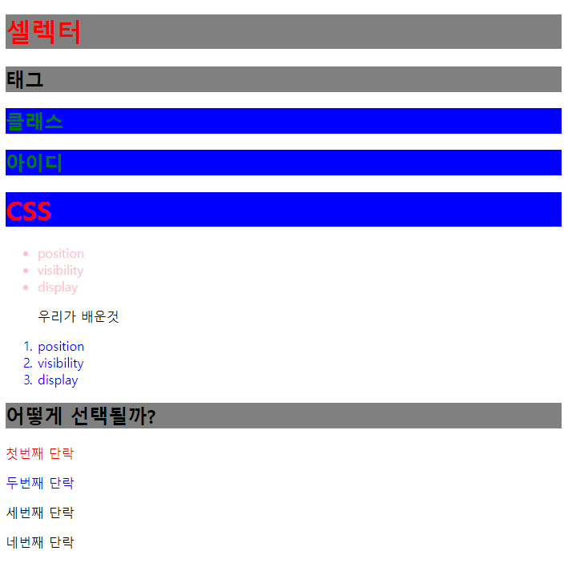
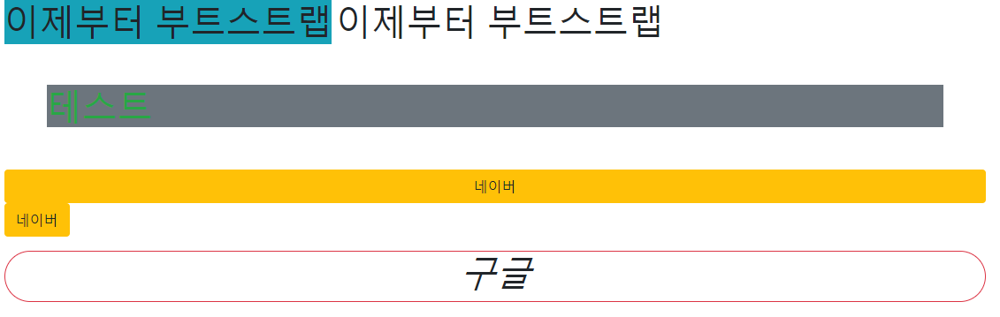
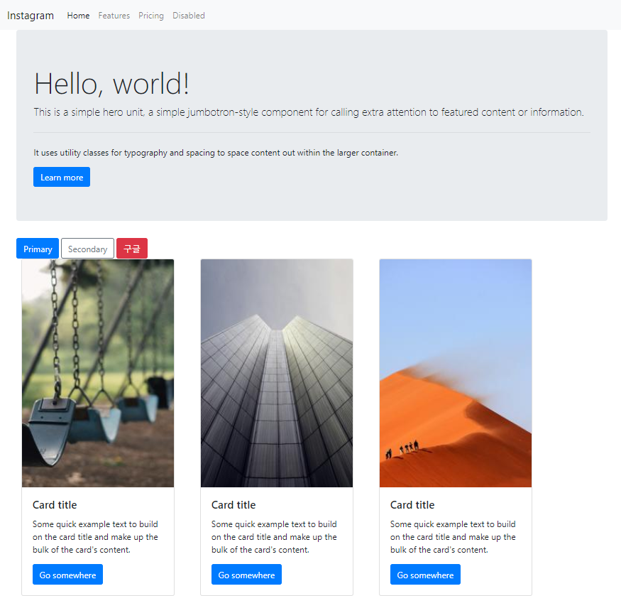
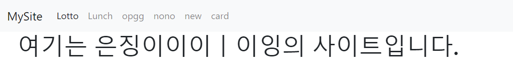
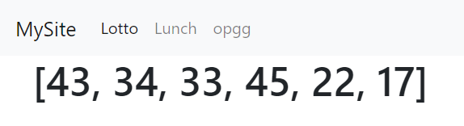
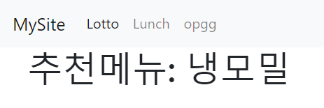
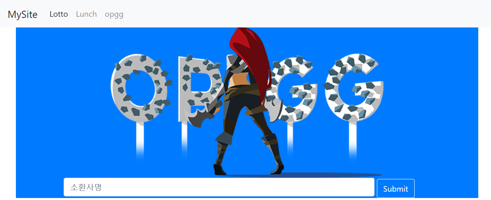

## 190730_Web_CSS, Bootstrap, Flask

<br>

## CSS

### 6. Selector 종류



> 06_selector.html

```html
<body>
    <h1 class="class-selector">셀렉터</h1>
    <h2>태그</h2>
    <h2 class="class-selector" id="id-selector">클래스</h2>
    <h2 id="id-selector">아이디</h2>

    <h1 id="id-selector">CSS</h1>

    <ul>
        <li>position</li>
        <li>visibility</li>
        <li>display</li>
    </ul>

    <ol>
        <p>우리가 배운것</p>
        <li>position</li>
        <li>visibility</li>
        <li>display</li>
    </ol>    

    <div id="ssafy">
        <h2>어떻게 선택될까?</h2>
        <p>첫번째 단락</p>
        <p>두번째 단락</p>
        <p>세번째 단락</p>
        <p>네번째 단락</p>
    </div>
</body>
```

> 06_selector.css

```css
/* 모든 엘리먼트 */
/* *{
    color: red;
} */

/* 태그셀렉터 */
/* important는 그 항목만 최우선순위! (별로 좋진않음) */
h1{
    color: red !important;
    background-color: black;
}
/* 그룹 */
h1, h2{
    background-color: gray;
}
/* 클래스셀렉터 */
.class-selector{
    color: blue;
}
/* 아이디셀렉터 */
#id-selector{
    color: green;
    background-color: blue;
}

/* 셀렉터들은 우선순위가 있다.
(!important) > 아이디 > 클래스 > 태그 */


/* 자식셀렉터 */
ul > li{
    color: pink;
}
/* 바로 뒤에 인접한 형제 */
p + li{
    color: green;
}
/* 그 뒤의 모든 형제 */
p ~ li{
    color: blue;
}

/* :nth-child 셀렉터
    모든 자식에서의 순서를 찾음.
    해당 element가 아니면 선택되지 않음.*/
#ssafy > p:nth-child(2){
    color: red;
}
/* :nth-of-type 셀렉터
    해당하는 자식 태그 요소에서의 순서를 찾음. */
#ssafy > p:nth-of-type(2){
    color: blue;
}
```

<br>

## Bootstrap

- ##### Bootstrap 사용하기 (반응형)

  1. [https://getbootstrap.com](https://getbootstrap.com/)
  2. Documentation -> Introduction -> head 안에 CSS (1줄), body 안에 JS (3줄) 코드 복사, 붙여넣기
  3. 사용법 공식문서 참조

```html
<head>
    <link rel="stylesheet" href="https://stackpath.bootstrapcdn.com/bootstrap/4.3.1/css/bootstrap.min.css" integrity="sha384-ggOyR0iXCbMQv3Xipma34MD+dH/1fQ784/j6cY/iJTQUOhcWr7x9JvoRxT2MZw1T" crossorigin="anonymous">
</head>
```

```html
<body>
    <script src="https://code.jquery.com/jquery-3.3.1.slim.min.js" integrity="sha384-q8i/X+965DzO0rT7abK41JStQIAqVgRVzpbzo5smXKp4YfRvH+8abtTE1Pi6jizo" crossorigin="anonymous"></script>
    <script src="https://cdnjs.cloudflare.com/ajax/libs/popper.js/1.14.7/umd/popper.min.js" integrity="sha384-UO2eT0CpHqdSJQ6hJty5KVphtPhzWj9WO1clHTMGa3JDZwrnQq4sF86dIHNDz0W1" crossorigin="anonymous"></script>
    <script src="https://stackpath.bootstrapcdn.com/bootstrap/4.3.1/js/bootstrap.min.js" integrity="sha384-JjSmVgyd0p3pXB1rRibZUAYoIIy6OrQ6VrjIEaFf/nJGzIxFDsf4x0xIM+B07jRM" crossorigin="anonymous"></script>
</body>
```

<br>

### 1. intro



> 00_intro.html

```html
<body>
    <!-- Components, Utilities 등 설정(Bootstrap 공식문서 참조) -->
    <div class="container">
        <!-- 항상 container로 감싸줘야 한다. -->
        <h1 class="mx-auto bg-info d-inline" style="width:50%">이제부터 부트스트랩</h1>
        <h1 class="mx-auto d-inline" style="width:50%">이제부터 부트스트랩</h1>
        <h1 class="m-5 bg-secondary text-success">테스트</h1>
        
        <!-- sm사이즈 일때는 display를 none으로 설정(반응형) -->
        <h1 class="d-sm-none">display</h1> 
        <a href="https://www.naver.com" class="d-block btn btn-warning">네이버</a>
        <a href="https://www.naver.com" class="btn btn-warning">네이버</a>
        <div class="my-3 border border-danger rounded-pill text-center">
            <h1 class="font-italic">구글</h1>
        </div>
    </div>
</body>
```
- div.container + `Tap`

<br>

### 2. Grid Layout


> 01_grid.html
```html
<body>
    <!-- grid: 화면을 전체 12칸으로 등분한다. 항상 container로 감싸줘야한다. -->
    <div class="container">
        <!-- 한 줄(row)을 6칸(col-6)으로 나눈다. -->
        <div class="row">
            <div class="col-2 col-sm-6 col-md-2 col-lg-6 col-xl-2 bg-danger">
                여기는 여섯칸
            </div>
        </div>
        <div class="row">
            <div class="col-6 bg-info">
                여기는 여섯칸
            </div>
        </div>
    </div>
</body>
```

<br>

### 3. Component




```html
<body>
    <!-- 1.Nav (컨테이너밖) -->
    <nav class="navbar navbar-expand-lg navbar-light bg-light">
        <a class="navbar-brand" href="01_grid.html">Instagram</a>
        <button class="navbar-toggler" type="button" data-toggle="collapse" data-target="#navbarNav" aria-controls="navbarNav" aria-expanded="false" aria-label="Toggle navigation">
            <span class="navbar-toggler-icon"></span>
        </button>
        <div class="collapse navbar-collapse" id="navbarNav">
            <ul class="navbar-nav">
            <li class="nav-item active">
                <a class="nav-link" href="#">Home <span class="sr-only">(current)</span></a>
            </li>
            <li class="nav-item">
                <a class="nav-link" href="#">Features</a>
            </li>
            <li class="nav-item">
                <a class="nav-link" href="#">Pricing</a>
            </li>
            <li class="nav-item">
                <a class="nav-link" href="#" tabindex="-1" aria-disabled="true">Disabled</a>
            </li>
            </ul>
        </div>
    </nav>
    <div class="container">
        <!--2.Jumbotron (컨테이너안) -->
        <div class="jumbotron">
            <h1 class="display-4">Hello, world!</h1>
            <p class="lead">This is a simple hero unit, a simple jumbotron-style component for calling extra attention to featured content or information.</p>
            <hr class="my-4">
            <p>It uses utility classes for typography and spacing to space content out within the larger container.</p>
            <a class="btn btn-primary btn-  " href="#" role="button">Learn more</a>
        </div>
        <!-- 3.Buttons (컨테이너안) -->
        <button type="button" class="btn btn-primary">Primary</button>
        <button type="button" class="btn btn-outline-secondary">Secondary</button>
        <a class="btn btn-danger" href="https://google.com">구글</a>
        <!-- 4.Card (컨테이너안) -->
        <div class="row">
            <div class="card d-inline mx-4" style="width: 18rem;">
                
                <div class="card-body">
                    <h5 class="card-title">Card title</h5>
                    <p class="card-text">Some quick example text to build on the card title and make up the bulk of the card's content.</p>
                    <a href="#" class="btn btn-primary">Go somewhere</a>
                </div>
            </div>
            <div class="card d-inline mx-4" style="width: 18rem;">
                
                <div class="card-body">
                    <h5 class="card-title">Card title</h5>
                    <p class="card-text">Some quick example text to build on the card title and make up the bulk of the card's content.</p>
                    <a href="#" class="btn btn-primary">Go somewhere</a>
                </div>
            </div>
            <div class="card d-inline mx-4" style="width: 18rem;">
                
                <div class="card-body">
                    <h5 class="card-title">Card title</h5>
                    <p class="card-text">Some quick example text to build on the card title and make up the bulk of the card's content.</p>
                    <a href="#" class="btn btn-primary">Go somewhere</a>
                </div>
            </div>
        </div>
        <!-- 5.Carousel (컨테이너안) -->
        <!-- 생략 -->
    </div>
</body>
```

<br>

## [예제] HTML, Bootstrap, Flask

### MySite 만들기

> app.py (Flask 이용)
```python
from flask import Flask, escape, request, render_template
import random
import requests
from bs4 import BeautifulSoup

app = Flask(__name__)

@app.route('/')
def hello():
    return render_template('index.html')

@app.route('/lotto')
def lotto():
    numbers = random.sample(range(1, 46), 6)
    print(numbers)
    return render_template('lotto.html', numbers=numbers) 

@app.route('/lunch')
def lunch():
    menu = ['파스타','전주비빔밥','만둣국','알밥','돈가스','짬뽕밥','냉모밀', '나주곰탕']
    choice = random.choice(menu)
    return render_template('lunch.html', choice=choice)

@app.route('/opgg')
def opgg():
    return render_template('opgg.html')

@app.route('/search')
def search():
    opgg_url = 'https://www.op.gg/summoner/userName='
    summoner = request.args.get('summoner')
    url = opgg_url + summoner

    res = requests.get(url).text
    soup = BeautifulSoup(res, 'html.parser')
    tier = soup.select_one('#SummonerLayoutContent > div.tabItem.Content.SummonerLayoutContent.summonerLayout-summary > div.SideContent > div.TierBox.Box > div > div.TierRankInfo > div.TierRank')
    user_tier = tier.text.strip()
    return render_template('search.html', user_tier=user_tier, summoner=summoner)

if __name__=="__main__":
    app.run(debug=True)
```

> base.html (Navbar 만들기- Bootstrap 이용)
```html
<body>
  <!-- Nav -->
  <nav class="navbar navbar-expand-lg navbar-light bg-light">
    <a class="navbar-brand" href="/">MySite</a>
    <button class="navbar-toggler" type="button" data-toggle="collapse" data-target="#navbarNavAltMarkup" aria-controls="navbarNavAltMarkup" aria-expanded="false" aria-label="Toggle navigation">
      <span class="navbar-toggler-icon"></span>
    </button>
    <div class="collapse navbar-collapse" id="navbarNavAltMarkup">
      <div class="navbar-nav">
        <a class="nav-item nav-link active" href="/lotto">Lotto <span class="sr-only">(current)</span></a>
        <a class="nav-item nav-link" href="/lunch">Lunch</a>
        <a class="nav-item nav-link" href="/opgg">opgg</a>
      </div>
    </div>
  </nav>
  <div class="container">
    
    
  </div>
</body>
```



> index.html

```html

<!-- base.html을 확장(중복제거) -->


  <h1>여기는 저의 사이트입니다.</h1>

```



> lotto.html

```html


  <h1>{{numbers}}</h1>

```



> lunch.html

```html


  <h1>추천메뉴: {{choice}}</h1>

```



> opgg.html

```html


  <div class="bg-primary">
    
    <form action="/search">
      <div class="form-group px-5">
        <input type="text" class="form-control d-inline w-75 ml-5" name="summoner" placeholder="소환사명">
        <button type="submit" class="btn btn-primary border-white">Submit</button>
      </div>
    </form>
  </div>

```

> search.html

```html


  <h1>여기는 결과창입니다.</h1>
  <p>{{summoner}}님의 등급은 {{user_tier}}입니다.</p>

```