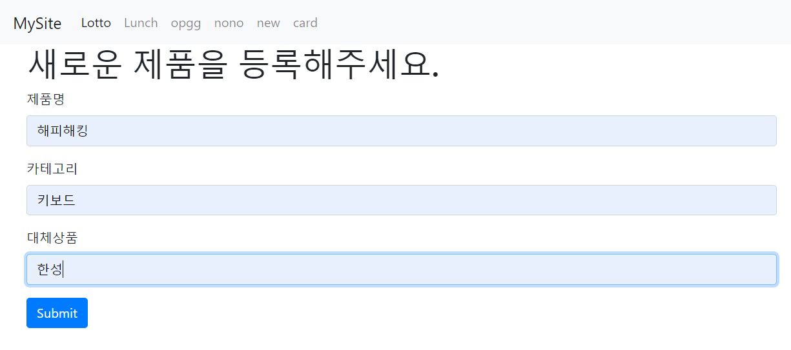

## 190801_Web_CSS, Bootstrap, Flask

<br>

### [예제2] Nono Japan 페이지 추가하기

> app.py 추가한 코드 (Flask 이용)
```python
from flask import Flask, escape, request, render_template
import random
import requests
from bs4 import BeautifulSoup

app = Flask(__name__)

@app.route('/')
def hello():
    return render_template('index.html')

# 추가한 코드
@app.route('/nono')
def nono():
    with open('data.csv', 'r', encoding='utf-8') as f:
        reader = csv.reader(f)
        products = list(reader)
    return render_template('nono.html', products=products)

@app.route('/new')
def new():
    return render_template('new.html')

@app.route('/create')
def create():
    print(request.args)
    product = request.args.get('product')
    category = request.args.get('category')
    replace = request.args.get('replace')

    with open('data.csv', 'a+', encoding='utf-8', newline='') as f:
        writer = csv.writer(f)
        # ['해피해킹', '키보드', '한성']
        product_info = [product, category, replace]
        writer.writerow(product_info)
    return render_template('create.html')

@app.route('/card')
def card():
    with open('data.csv', 'r', encoding='utf-8') as f:
        reader = csv.reader(f)
        products = list(reader)
    return render_template('card.html', products=products)

# python app.py
if __name__=="__main__":
    app.run(debug=True)
```

> base.html 추가한코드 (Navbar 만들기- Bootstrap 이용)
```html
<body>
  <!-- Nav -->
  <nav class="navbar navbar-expand-lg navbar-light bg-light">
    <a class="navbar-brand" href="/">MySite</a>
    <button class="navbar-toggler" type="button" data-toggle="collapse" data-target="#navbarNavAltMarkup" aria-controls="navbarNavAltMarkup" aria-expanded="false" aria-label="Toggle navigation">
      <span class="navbar-toggler-icon"></span>
    </button>
    <div class="collapse navbar-collapse" id="navbarNavAltMarkup">
      <div class="navbar-nav">
        <a class="nav-item nav-link active" href="/lotto">Lotto <span class="sr-only">(current)</span></a>
        <a class="nav-item nav-link" href="/lunch">Lunch</a>
        <a class="nav-item nav-link" href="/opgg">opgg</a>
          
        <!-- 추가한 코드 -->
        <a class="nav-item nav-link" href="/nono">nono</a>
        <a class="nav-item nav-link" href="/new">new</a>
        <a class="nav-item nav-link" href="/card">card</a>
      </div>
    </div>
  </nav>
  <div class="container">
    
    
  </div>
</body>
```

> nono.html


```html


  <h1>여기는 일제목록입니다.</h1>
  <!--{# 
    {{product}}
   #}-->

  <table class="table table-striped">
    <thead>
      <tr>
        <th scope="col">#</th>
        <th scope="col">제품명</th>
        <th scope="col">대체상품</th>
        <th scope="col">카테고리</th>
      </tr>
    </thead>
    <tbody>
      
      <tr>
        <th scope="row">1</th>
        <td>{{product[0]}}</td>
        <td>{{product[2]}}</td>
        <td>{{product[1]}}</td>
      </tr>
      
    </tbody>
  </table>

```

> new.html



```html


  <h1>새로운 제품을 등록해주세요.</h1>
  <form action="/create">
    <div class="form-group">
      <label for="product">제품명</label>
      <input type="text" class="form-control" id="product" name="product">
    </div>
    <div class="form-group">
      <label for="category">카테고리</label>
      <input type="text" class="form-control" id="category" name="category">
    </div>
    <div class="form-group">
      <label for="replace">대체상품</label>
      <input type="text" class="form-control" id="replace" name="replace">
    </div>
    <button type="submit" class="btn btn-primary">Submit</button>
  </form>

```

> create.html


```html


  <h1>저장이 완료되었습니다.</h1>

```

> card.html


```html


<br>
<h5>일본 관련 제품</h5>
<div class="row">
  
  <div class="card m-2 shadow-sm mb-5 bg-white rounded" style="width: 18rem;">
    <ul class="list-group list-group-flush">
      <li class="list-group-item">
        
        <strong>{{product[0]}}</strong>
      </li>
      <li class="list-group-item"><p >대체상품</p>
        <div class="badge badge-info rounded-pill" style="padding-top: 0.6rem; width: 3rem; height: 2rem">
            {{product[2]}}
        </div>
      </li>
      <li class="list-group-item text-muted">#{{product[1]}}</li>
    </ul>
  </div>
  
</div>

```
